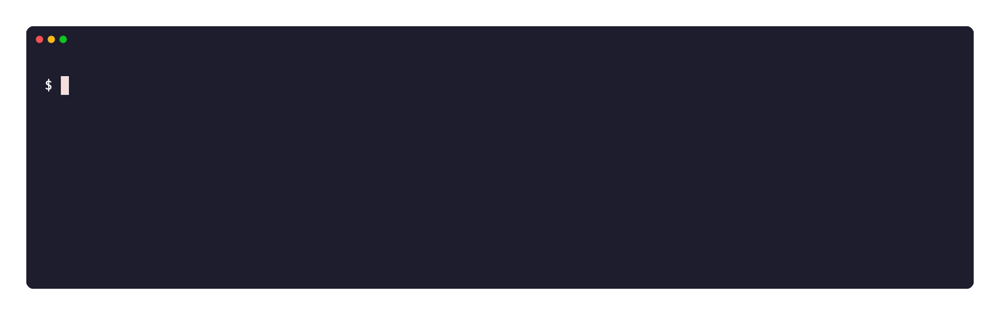
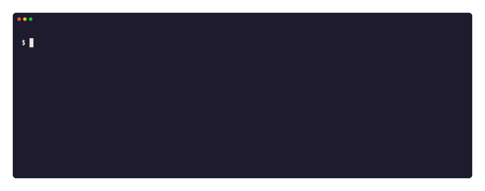
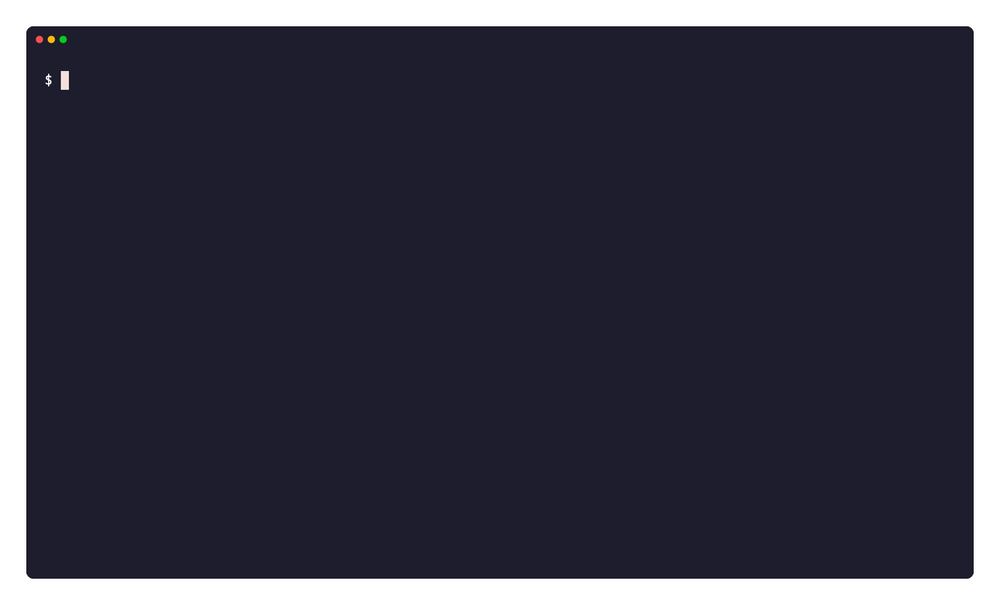

[English](README.md) | **한국어**

# edc

`edc`는 **everyday carry**의 줄임말입니다. everyday carry는 주머니에 넣고 다니면서 가장 먼저 꺼내 쓰는 작은 도구 모음을 뜻합니다. `edc`는 SE와 SRE가 terminal에서 그렇게 쓰는 도구입니다.

장애가 나면 첫 질문은 하나입니다. 원인이 내 쪽인지, 네트워크인지, 상대편인지. `edc`는 명령 하나로 답합니다. DNS, TCP, TLS, HTTP, route, ping, interface, socket을 한 번에 확인하고 결과를 모두 같은 형식으로 출력합니다. Linux와 macOS의 host resource와 host 정보도 함께 보여 주며, macOS에서는 `networkQuality`를 실행합니다.

모든 command는 read-only입니다. `edc`는 원인을 찾는 데서 멈춥니다. DNS flush, interface reset, firewall 변경 같은 자동 복구를 하지 않으므로 운영 중인 host에서도 그대로 씁니다.


한 번 실행에 3초쯤 걸립니다. 각 줄은 probe 이름, 대상, 결과를 같은 열에 맞추므로 열 하나만 따라 내려가면 실패한 probe가 보입니다.

데모 화면은 기본 언어인 영어입니다. `EDC_LANG=ko`를 지정하면 한국어로 나옵니다. [언어](#언어)를 보십시오.

각 데모의 소스는 [`docs/tape/`](docs/tape) 아래 `.tape` 파일입니다. `vhs docs/tape/doctor.tape`처럼 실행하면 다시 만듭니다.

## 설치

script로 최신 release를 설치합니다. script는 운영체제와 architecture를 읽고, SHA-256을 확인한 다음 실행 파일을 설치합니다.

```bash
curl -fsSL https://raw.githubusercontent.com/x-mesh/edc/main/install.sh | sh
```

script는 `edc`를 `~/.local/bin`에 설치합니다. 다른 디렉터리에 넣으려면 `BINDIR`을, 이전 버전을 받으려면 `EDC_VERSION`을 지정합니다.

```bash
curl -fsSL https://raw.githubusercontent.com/x-mesh/edc/main/install.sh | BINDIR=/usr/local/bin sh
curl -fsSL https://raw.githubusercontent.com/x-mesh/edc/main/install.sh | EDC_VERSION=0.1.0 sh
```

release에는 Linux와 macOS의 `amd64`, `arm64` 실행 파일이 들어 있습니다.

## 업데이트

`edc update`는 최신 release를 읽고 SHA-256을 확인한 다음 실행 중인 파일을 바꿉니다.

```bash
edc update           # 확인한 다음 교체
edc update --check   # 두 버전만 출력
edc update --yes     # 확인 생략
```

`edc`는 새 파일을 기존 파일 옆에 쓰고 이름을 바꿉니다. 내려받기가 실패하면 기존 실행 파일이 그대로 남습니다. 디렉터리에 쓸 권한이 없으면 내려받기 전에 exit code `3`으로 멈춥니다.

## 빌드

Go 1.25 이상이 필요합니다. 실시간 화면은 다음 dependency를 씁니다.

- `charm.land/bubbletea/v2`
- `charm.land/bubbles/v2`
- `charm.land/lipgloss/v2`

```bash
make build VERSION=0.1.0-dev
./bin/edc version
```

`edc`를 `~/.local/bin`에 설치합니다.

```bash
make install VERSION=0.1.0-dev
~/.local/bin/edc version
```

다른 경로에 설치하려면 `PREFIX`나 `BINDIR`을 지정합니다.

```bash
make install PREFIX=/usr/local
```

## 언어

`edc`는 기본으로 영어를 씁니다. 한국어와 일본어도 함께 담고 있습니다.

언어는 설정 파일에서 정합니다. `edc`는 `os.UserConfigDir()/edc/config.yaml`을 읽습니다. Linux에서는 `~/.config/edc/config.yaml`, macOS에서는 `~/Library/Application Support/edc/config.yaml`입니다.

```yaml
# config.yaml
lang: ko
```

한 번만 다른 언어로 보려면 `EDC_LANG`을 씁니다. 설정 파일보다 우선합니다.

```bash
EDC_LANG=ja edc where
```

`en`, `ko`, `ja`를 받습니다. `ko_KR.UTF-8` 같은 locale 이름을 주면 앞의 언어 부분만 봅니다. 모르는 값은 영어로 내려가고, 어떤 언어에 빠진 메시지도 영어로 내려갑니다.

## Command 기본값

같은 config file에 반복 실행해도 안전한 command 기본값을 둘 수 있습니다. 우선순위는 built-in, config, 명시한 CLI option 순서입니다. `--redact=false`처럼 명시한 boolean도 config의 `redact: true`를 덮습니다. 모르는 key, 잘못된 type이나 범위가 있으면 조용히 무시하지 않고 command 실행 전에 exit code `2`로 멈춥니다.

terminal에서 `edc setup`을 실행하면 file을 만들거나 수정하는 wizard가 열립니다. section별로 설정하고 Enter로 기존 값을 유지하며, optional 값은 `!clear`로 제거합니다. 전체 YAML을 미리 보여 준 뒤 확인을 받아 mode `0600`으로 atomic 저장합니다. config directory는 mode `0700`이며 취소하면 exit code `4`입니다.

```yaml
lang: ko
defaults:
  common: {timeout: 15s, json: "", verbose: false, redact: true}
  doctor: {profile: default}
  tls: {min_days: 14}
  http: {expect_status: 200}
  top: {interval: 2s, count: 10, no_header: false, json: ""}
  info: {public: false, timeout: 3s, verbose: false}
  where: {provider: all, count: 3}
  capture: {interface: "", duration: 15s, count: 500, filter: "", output: ""}
  remote: {inventory: "", recipe: "", connect_timeout: 10s, output_limit: 65536, parallel: 0}
  update: {timeout: 60s}
  log: {stream: stderr, output: /absolute/path/to/edc.log, command_display: full}
```

command별 값은 `defaults.common`을 덮습니다. positional target, URL, host, remote group과 `yes`, `force`, `dry-run`, `list`, `check` 같은 action option은 저장하지 않습니다. 저장하는 remote inventory와 recipe는 absolute path여야 합니다. 빈 path 값은 해당 기본값을 사용하지 않는다는 뜻입니다.

Setup wizard는 macOS에서 `~/Library/Logs/edc.log`, Linux에서 `${XDG_STATE_HOME:-~/.local/state}/edc/edc.log`를 추천합니다. 이 추천값에 한해 `edc log`가 parent directory를 만들며, 직접 지정한 output path는 parent directory가 이미 있어야 합니다.

## 빠른 시작

```bash
# 실시간 host resource 대시보드 (q로 종료)
./bin/edc top
# 표를 흘려 보내는 기존 출력
./bin/edc top --interval 2s --count 10
# sample당 한 줄 JSON
./bin/edc top --count 5 --json -

# system/network/disk 정보와 public IP
./bin/edc info
# 외부 ipinfo.io 요청 없이 실행
./bin/edc info --public=false

# 기본 종합 진단
./bin/edc doctor https://example.com

# machine-readable report 저장 (기본 redaction, 파일 mode 0600)
./bin/edc doctor --json report.json https://example.com
./bin/edc report show report.json
# 두 report 비교 (악화된 probe가 있으면 exit 1)
./bin/edc report diff before.json after.json

# bandwidth/responsiveness 측정을 포함한 종합 진단
./bin/edc doctor --profile full --timeout 60s example.com

# 개별 probe
./bin/edc dns lookup example.com
./bin/edc tcp check example.com:443
./bin/edc tls check example.com:443
./bin/edc tls check --min-days 14 example.com:443
./bin/edc http check https://example.com
./bin/edc http check --expect-status 200 https://example.com
./bin/edc net route example.com
./bin/edc net ping example.com
./bin/edc net trace example.com
./bin/edc net interfaces
./bin/edc sockets
./bin/edc quality --timeout 60s

# 어느 지역이 가깝고 이 망은 어떤 모습인지
./bin/edc where
./bin/edc where --provider aws --count 5

# shell completion
source <(./bin/edc completion zsh)

# 최신 release로 업데이트
./bin/edc update --check
```

공통 option은 `--timeout`, `--json <path|->`, `--verbose`, `--redact=true|false`입니다. Go `flag` 규칙에 따라 option은 target 앞에 둡니다.

`edc info`는 public IP를 기본으로 ipinfo.io에 조회합니다. 3초 안에 응답이 없으면 요청을 멈추고 그 줄을 빼고 출력합니다. 요청을 끄려면 `--public=false`를, 제한 시간을 바꾸려면 `--timeout`을, 실패 원인을 보려면 `-v`를 씁니다.

### 이름 조회



`--redact`가 기본으로 켜져 있어 IP는 `<ip:...>` 형태로 가려집니다.

### 연결 확인



실패한 probe는 phase와 cause를 ERROR 블록으로 보여 주고 exit code `1`을 돌려줍니다.

### 경로와 interface


## 어디에 있는가

`edc where`는 두 질문에 한 번에 답합니다. 이 host에서 어느 클라우드 지역이 가까운지, 그리고 이 망이 어떤 모습인지.

```bash
./bin/edc where
./bin/edc where --provider aws        # 사업자 하나만
./bin/edc where --count 5 -v          # 더 여러 번 재고 사업자별로 모두 보기
```

`edc`는 지역마다 공개 endpoint에 TCP handshake만 열고 끊습니다. 요청을 보내지 않고 본문도 읽지 않으므로 값에는 왕복 시간만 남습니다. 이름은 한 번만 풀고 그 주소로 연결해 DNS 시간이 거리 값에 섞이지 않게 합니다.

표는 endpoint를 도시로 묶고 도시마다 가장 빠른 사업자를 남깁니다. 사업자별 값을 모두 보려면 `-v`를 씁니다.

| 사업자 | endpoint |
|---|---|
| `aws` | `s3.<region>.amazonaws.com` |
| `gcp` | `storage.<region>.rep.googleapis.com` |

Azure는 넣지 않았습니다. 리전 이름이 붙은 공개 주소가 실제로 그 리전에서 끝나지 않아 값이 거리를 따르지 않습니다.

`edc where`는 public IP와 ASN, anycast가 고른 Cloudflare PoP, 그리고 로컬 망의 모습도 함께 보여 줍니다.

- NAT 뒤인지, 아니면 interface가 public 주소를 직접 쓰는지
- carrier-grade NAT 뒤인지. `100.64.0.0/10` 대역이 그 표시입니다
- tunnel을 지나는지. 기본 경로 interface가 그 표시입니다

terminal에서는 몇 곳을 확인했는지 진행 줄로 보여 줍니다. `q`로 취소합니다.

화면에는 주소를 그대로 씁니다. 이 명령은 그 값을 보려고 실행하기 때문입니다. `--redact`는 공유하는 산출물인 `--json` 출력에만 적용합니다.

`edc`는 확인한 것만 밝힙니다. 지터로 회선 종류를 짐작하지 않습니다. 지터는 숫자로 남기고 판단은 사용자에게 맡깁니다.

## Probe 임계값

`edc tls check`는 인증서 만료가 30일보다 적게 남으면 warning을 냅니다. `--min-days`를 지정하면 그보다 이른 만료를 실패로 처리합니다.

`edc http check`는 4xx 응답에 warning을, 5xx 응답에 실패를 냅니다. `--expect-status`를 지정하면 그 code만 통과하고 나머지는 실패입니다.

```bash
./bin/edc tls check --min-days 14 example.com:443
./bin/edc http check --expect-status 200 https://example.com/health
```

실패는 exit code `1`을 돌려줍니다. 이 option을 cron에 넣으면 synthetic check가 됩니다.


두 데모 모두 통과 한 번과 임계값 실패 한 번을 보여 줍니다.

## Report 비교

`edc report diff`는 두 JSON report를 probe 이름으로 맞춰 비교합니다. probe마다 status 변화와 scalar metric 차이를 보여 줍니다.

```bash
./bin/edc doctor --json before.json https://example.com
./bin/edc doctor --json after.json https://example.com
./bin/edc report diff before.json after.json
./bin/edc report diff --json diff.json before.json after.json
```

status가 pass에서 warn이나 fail로, 또는 warn에서 fail로 바뀌면 그 probe를 `WORSE`로 표시합니다. 악화된 probe가 하나라도 있으면 exit code는 `1`입니다. `metrics` 안의 배열과 객체는 diff에 나오지 않습니다.

## Report 뷰어

stdin과 stdout이 모두 terminal이면 `edc report show`와 `edc report diff`는 전체 화면 뷰어를 엽니다.

| key | 동작 |
|---|---|
| `f` | 필터 변경 |
| `e` | 상세 펼치기와 접기 |
| `↑` `↓` `PgUp` `PgDn` | 스크롤 |
| `q` | 종료 |

`edc report show`의 필터는 전체, 실패와 경고, 실패만 순서로 바뀝니다. `edc report diff`의 필터는 전체, 바뀐 것, 악화된 것 순서로 바뀝니다.

뷰어는 화면에 출력을 남기지 않습니다. exit code는 그대로입니다. 파이프, 파일, `--json`은 기존 출력을 받습니다.


데모는 뷰어를 열어 필터를 바꾸고 상세를 펼친 다음, 두 report를 비교합니다.

## Top 임계값

`edc top`은 load, CPU, iowait, memory 값에 색을 넣습니다. 흰색은 정상, 주황색은 경고, 빨간색은 위험입니다.

load 임계값은 host의 core 수를 따릅니다.

| 값 | 경고 | 위험 |
|---|---|---|
| load | 0.7 × cores | 1.0 × cores |
| usr%, sys% | 70 | 90 |
| i/o | 10 | 25 |
| mem_% | 90 | 95 |

색을 끄려면 `NO_COLOR`를 설정합니다. 파이프와 파일에는 색이 들어가지 않습니다.

`edc info`는 disk마다 막대를 그립니다. 막대는 `mem_%`와 같은 임계값을 쓰고 한 칸이 5퍼센트입니다. 막대는 색 없이도 수준을 보여 주므로 파이프에서도 정보가 남습니다.

`edc info`는 disk 사용량을 전체 크기에서 남은 공간을 뺀 값으로 셉니다. macOS에서는 여러 APFS volume이 container 하나를 나눠 쓰므로, volume 하나의 `Used` 열만 보면 다른 volume이 차지한 공간이 빠집니다.

macOS에서 `edc`는 memory 사용량을 `vm_stat`에서 읽습니다. free, speculative, inactive page를 빼는데, 이는 Linux의 `MemAvailable`과 같은 기준입니다. `top`의 `PhysMem` 줄은 cache를 포함하므로 97퍼센트 위에 머뭅니다.

## Top 대시보드

stdin과 stdout이 모두 terminal이면 `edc top`은 전체 화면 대시보드를 엽니다. 대시보드에는 `--count` 제한이 필요 없습니다.

| key | 동작 |
|---|---|
| `q` | 종료 |
| `p` | 일시정지와 재개 |
| `+` | interval 늘리기 |
| `-` | interval 줄이기 |

interval은 200ms, 500ms, 1s, 2s, 5s, 10s, 30s, 1m 사이를 오갑니다. 일시정지 중에는 방향키와 page키로 지난 행을 스크롤합니다.

대시보드는 이전 화면으로 빠져나가며 행을 남기지 않습니다. 값을 남기려면 `--json`을 씁니다.

다음 경우에는 대시보드 대신 기존 표를 출력합니다.

- `--count`나 `--json`을 지정한 경우
- stdin이나 stdout이 terminal이 아닌 경우
- `NO_COLOR`가 설정된 경우

일시정지를 푼 뒤 나오는 첫 행은 멈춰 있던 구간의 평균 rate를 보여 줍니다.

macOS에서 `edc`는 CPU 값을 `top`에서 읽는데, `top`은 sample 하나에 1초쯤 걸립니다. `edc`는 `top`을 배경에서 돌리므로 interval을 줄이면 network, disk, memory, load는 그대로 빠르게 갱신됩니다. CPU 열은 다음 `top` sample이 올 때까지 같은 값을 유지합니다. Linux에서는 `/proc/stat`을 직접 읽어 모든 열이 interval을 따릅니다.

## Top JSON 출력

`--json`을 쓰면 sample마다 JSON 객체를 한 줄씩 씁니다. stdout으로 보내려면 `-`를 씁니다. 경로를 주면 mode 0600으로 새 파일을 만듭니다.

```bash
./bin/edc top --count 5 --json -
```

각 줄에는 `time`, `hostname`, `cores`, 초당 byte 단위 network·disk rate, 퍼센트 단위 CPU 값, `load1`, `memory_pct`가 들어갑니다. `--json`은 표와 헤더를 없앱니다.

## Remote recipe

`edc remote <group>`은 inventory group에 YAML recipe를 실행합니다. 로컬 OpenSSH 설정, agent, known host 검사를 그대로 씁니다.

각 command는 원격 계정의 기본 shell을 대화형으로 띄웁니다. shell 시작 출력과 prompt hook은 화면에 나오지 않습니다.

inventory와 recipe 파일에는 비밀번호와 개인 키를 넣지 않습니다. SSH alias는 `~/.ssh/config`에 설정합니다.

step마다 `name`과 `command`가 필요합니다. `verify`는 선택입니다. `verify`가 없으면 `command`의 exit code가 step 결과를 정합니다.

group에서 참조하려면 `name`을 유지합니다. `target`이 없으면 `edc`는 `name`을 SSH target으로 씁니다.



데모는 recipe의 tags와 `--dry-run`이 출력하는 계획 표를 보여 줍니다.

### 명령 형태

group은 위치 인자입니다. `--group` flag는 같은 값을 받는 별칭입니다. 둘 중 하나만 씁니다.

```bash
cp examples/remote/inventory.yaml ./inventory.yaml
./bin/edc remote              # group을 고른 다음 확인
./bin/edc remote daily        # group을 지정한 다음 확인
./bin/edc remote daily -f     # group을 지정하고 확인을 생략
```

`edc`는 `./inventory.yaml`을 먼저 찾습니다. 없으면 `os.UserConfigDir()/edc/inventory.yaml`을 봅니다. 이 경로는 운영체제를 따릅니다. `recipe.yaml`도 같은 순서로 찾습니다.

`--inventory`와 `--recipe`는 찾은 파일보다 우선합니다.

group을 지정하면 `edc`는 경로를 묻지 않습니다. 계획을 보여 주고 확인만 받습니다.

group을 지정하지 않으면 `edc`는 group부터 고릅니다. 그다음 inventory 경로를 보여 주고, recipe를 고르고, 확인을 받습니다.

대화형 선택기는 목록을 그 자리에 그립니다. 위아래 방향키나 `j`, `k`로 움직입니다. Enter로 선택하고, `q`나 Esc로 취소합니다. 취소하면 exit code `4`를 돌려줍니다.

고르는 동안 `edc`는 커서가 놓인 행의 색을 반전하고 왼쪽에 `▌` 막대를 붙입니다. 반전 덕분에 흑백 terminal에서도 행이 분명합니다.

선택한 뒤에도 목록은 화면에 남습니다. 막대는 고른 항목에 반전 없이 남고, 첫 줄에는 질문 이름이 그대로 있습니다.

```
inventory 파일
  lab-hosts.yaml  ·  group 1개, host 1개
▌ prod-hosts.yaml  ·  group 2개, host 2개
```

`inventory.yaml`을 찾지 못하면 `edc`는 탐색 디렉터리의 YAML 파일 중 inventory로 읽히는 것을 나열합니다. 목록에는 group과 host 개수가 나옵니다. recipe 목록에는 recipe 이름과 step 개수가 나옵니다. inventory도 recipe도 아닌 YAML 파일은 숨깁니다. 목록이 비면 `edc`는 경로를 묻습니다.

확인 질문은 질문, 두 답, key 안내를 한 줄에 놓습니다. 좌우 방향키로 옮기고 Enter로 답하거나, `y`나 `n`으로 바로 답합니다. 가리킨 답에는 `▌` 막대와 반전 색이 붙습니다. 기본 답은 아니오입니다.

`-f`나 `--force`를 쓰면 확인을 생략합니다. `-v`와 함께 쓰면 출력을 흘려보냅니다. group을 지정하지 않은 채 `-f`를 쓰려면 inventory에 group이 정확히 하나 있어야 합니다.

`run`, `list`, `plan`, `hosts`, `groups`는 앞으로 쓸 subcommand 이름이라 group 이름으로 예약돼 있습니다. 이 중 하나를 쓴 inventory는 로드에 실패합니다.

기존 `edc remote run` 형태는 없어졌습니다. `edc remote <group>`을 씁니다.

### Dry run과 inventory 목록

`-n`이나 `--dry-run`을 쓰면 계획만 출력하고 끝냅니다. `edc`는 SSH 연결을 열지 않습니다. `--json`을 더하면 계획을 JSON으로 받습니다.

```bash
./bin/edc remote daily --dry-run
./bin/edc remote daily --dry-run --json -
```

`-l`이나 `--list`를 쓰면 inventory의 group과 host를 출력합니다. group을 지정하면 그 group만 나옵니다.

```bash
./bin/edc remote --list
./bin/edc remote daily --list --json -
```

`--dry-run`과 `--list`는 `-f`와 함께 쓰지 못합니다. `--redact`가 켜져 있으면 JSON 출력에서 IP 주소를 가립니다. 그대로 두려면 `--redact=false`를 씁니다.

### Host tag

host와 step에 `tags`를 답니다. `tags`가 없는 step은 group의 모든 host에서 돕니다. `tags`가 있는 step은 같은 tag를 가진 host에서만 돕니다. 이렇게 하면 recipe 하나로 macOS와 Linux host에 다른 작업을 보냅니다.

```yaml
# inventory.yaml
hosts:
  - name: build-server
    tags: [linux]
  - name: workstation
    tags: [mac]
```

```yaml
# recipe.yaml
steps:
  - name: git-kit          # tags가 없으므로 모든 host가 이 step을 실행합니다
    command: git-kit update
    verify: git-kit --version
  - name: brew
    tags: [mac]
    command: brew update && brew upgrade
    verify: brew --version
  - name: apt
    tags: [linux]
    command: apt-get update && apt-get -y upgrade
    verify: apt-get --version
```

step과 맞지 않는 host는 그 step의 결과를 받지 않습니다. report는 실패한 host에 대해서만 skip 개수를 남깁니다.

group의 어떤 host도 step의 tag와 맞지 않으면 `edc`는 stderr에 경고를 찍고 계속 진행합니다. tag 철자를 확인합니다.

### 표 하나

`edc remote`는 계획과 결과에 표 하나를 씁니다. 행은 host, 열은 step입니다. 표는 모든 칸을 `·`로 시작하고, 그 host의 step이 끝날 때마다 칸이 바뀝니다. step의 tag가 host와 맞지 않으면 칸에 `–`가 나옵니다.

```
edc remote  daily  ·  host 3  ·  step 3  ·  실행 8
inventory  ./inventory.yaml      recipe  ./recipe.yaml

host          git-kit  x-mesh  brew
build-server  PASS     PASS       –
ci-runner     PASS     ⠋          –
workstation   PASS     ·          ·

⠋  ci-runner / x-mesh / command  ·  4/8 완료  6.6s

git-kit  git-kit update  →  git-kit --version
x-mesh   xm update  →  xm version
brew     brew update && brew upgrade -f   tags mac
```

표 아래 줄은 지금 도는 host, step, phase를 알려 줍니다. 그 아래 줄들은 step마다의 command를 보여 줍니다.

stdin과 stdout이 모두 terminal이면 확인 질문이 이 표 바로 아래, command 목록 위에 나옵니다. 가리킨 답에는 `▌` 막대와 반전 색이 붙습니다. 좌우 방향키와 Enter로 답하거나 `y`, `n`으로 답합니다. 그 줄은 곧 진행 줄로 바뀌고 표가 채워집니다. 질문을 건너뛰려면 `-f`를 씁니다.

```
host   uname  uptime
alpha  ·      ·

실행할까요?     예   ▌ 아니오       ←/→ 이동   Enter 선택   y/n 바로 답하기
```

표는 terminal 너비에 맞춥니다. `edc`는 열 이름을 먼저 줄이고, 그다음 `PASS`와 `FAIL`을 범례와 함께 `✓`, `✗`로 바꾸고, 마지막에 host 이름을 줄입니다.

`-v`를 더하면 표 아래에 마지막 출력 줄들을 보여 줍니다.

취소하려면 Ctrl-C를 누릅니다. `edc`는 돌던 command를 멈추고, 남은 step을 `SKIP`으로 표시하고, 요약을 출력하고, exit code `4`를 돌려줍니다. Ctrl-C를 한 번 더 누르면 화면을 즉시 닫습니다.

stdin이나 stdout이 terminal이 아니거나, `--json`을 지정했거나, `NO_COLOR`가 설정되면 표 대신 기존 결과 줄을 출력합니다.

### 자동화

cron이나 launchd에서는 flag를 모두 지정합니다. terminal이 아닌 실행은 입력을 기다리지 않고 확인도 건너뜁니다.

```bash
./bin/edc remote daily \
  --inventory ./inventory.yaml \
  --recipe ./examples/remote/daily-update.yaml \
  --parallel 2 \
  --json ./remote-report.json
```

terminal이 아닌 실행에는 group이 필요합니다. 위치 인자나 `--group`으로 지정합니다.

원격 command를 그대로 흘려보려면 `-v`나 `--verbose`를 씁니다.

`edc`는 step이 끝날 때마다 PASS나 FAIL 줄을 출력합니다. 마지막 출력은 실패 목록과, 개수·경과 시간을 담은 요약 한 줄입니다.

host를 동시에 돌리려면 inventory에 `parallel`을 설정합니다. group 하나에만 적용하려면 `group_options.<group>.parallel`을 씁니다.

`--parallel` option은 두 inventory 값보다 우선합니다. host 안에서 step은 여전히 순서대로 돕니다.

host는 inventory 순서로 돕니다. step은 recipe 순서로 command와 verify command를 실행합니다.

step이 실패하면 `edc`는 그 host의 나머지 step을 건너뜁니다. 다음 host는 그대로 진행합니다. 실패가 하나라도 있으면 exit code `1`을 돌려줍니다.

## Probe 진행 줄

stdin과 stdout이 모두 terminal이면 단일 probe command는 진행 줄 하나를 보여 줍니다. 그 줄에는 probe 이름, target, 경과 시간, command의 마지막 출력 줄이 들어갑니다.

```
⠋     net.trace                 example.com  2.9s  ·   4  <ip:778fad8d>  5.573 ms
```

`edc`는 probe가 300밀리초보다 오래 걸릴 때만 이 줄을 띄웁니다. 빨리 끝나는 probe는 결과만 출력합니다.

취소하려면 Ctrl-C를 누릅니다. `edc`는 command를 멈추고 exit code `4`를 돌려줍니다.

이 줄은 언제나 한 줄입니다. 긴 출력은 terminal 너비에서 잘립니다.

## Doctor 실시간 화면

stdin과 stdout이 모두 terminal이면 `edc doctor`는 probe마다 줄 하나를 보여 주고 probe가 끝날 때 그 줄을 갱신합니다. 끝난 줄은 화면에 남습니다. 그 뒤에 상세와 요약이 따라옵니다.

취소하려면 Ctrl-C를 누릅니다. `edc`는 돌던 probe를 멈추고 exit code `4`를 돌려줍니다.

stdin이나 stdout이 terminal이 아니거나, `--json`을 지정했거나, `NO_COLOR`가 설정되면 `edc`는 기다렸다가 마지막에 모든 줄을 출력합니다.

## Packet capture

`capture`만 privileged 작업이며, `doctor`는 `sudo`를 사용하지 않습니다. Capture에는 강제 상한(duration 60초, packet 10,000개)이 있고 기존 파일을 덮어쓰지 않습니다.

```bash
./bin/edc capture \
  --interface en0 \
  --duration 15s \
  --count 500 \
  --filter 'host 203.0.113.10 and port 443' \
  --output incident.pcap
```

PCAP에는 credential과 개인정보가 포함될 수 있습니다. JSON redaction은 PCAP payload에 적용되지 않습니다.

`edc capture`는 시작 전에 계획을 보여 줍니다. 계획에는 interface, duration, packet 상한, filter, 출력 경로, `edc`가 쓰는 권한이 들어갑니다. 좌우 방향키와 Enter로 답하거나 `y`, `n`으로 답합니다. 계획은 `tcpdump` 출력 위에 그대로 남습니다.

질문을 건너뛰려면 `--yes`를 씁니다. terminal이 아닌 실행은 계획을 출력하고 stdin에서 `y`나 `n`을 읽습니다.

## Cron과 application log

`edc log`는 command의 `stdout` 또는 `stderr` 한쪽을 file에 append합니다. 선택한 stream은 file로만 보내고, 다른 stream과 `stdin`은 cron 또는 호출 terminal에 그대로 연결합니다. application에 logging 기능이 없어도 조용히 실패한 cron 실행을 확인할 수 있습니다.

```cron
* * * * * /usr/local/bin/edc log -- /usr/local/bin/job --daily
```

짧은 형식은 `defaults.log.stream`, `output`, `command_display`를 사용합니다. 각 값은 기존 CLI option으로 다시 덮을 수 있습니다. config와 CLI 어디에도 stream과 output이 없으면 기존처럼 필수 option 오류를 냅니다.

실행마다 시간, duration, exit status를 담은 ASCII start/end marker를 남깁니다. 새 file은 mode `0600`으로 만들고 기존 file은 내용과 mode를 유지합니다. 같은 file을 대상으로 하는 실행은 서로 기다리므로 log block이 섞이지 않습니다. Child의 exit code와 signal status는 `edc`가 그대로 전달합니다.

기본값 `--command-display full`은 start marker에 argument 전체를 기록합니다. argument에 credential이 들어갈 수 있으면 `--command-display name` 또는 `none`을 사용하십시오. `edc log`는 append만 하며 rotation, compression, retention은 제공하지 않습니다. 보관 정책은 system log rotation service로 설정하십시오.

## Shell completion

`edc completion`은 completion script를 출력합니다. script는 command, option, 그리고 `edc`가 찾은 inventory의 group 이름을 완성합니다.

```bash
source <(edc completion zsh)
source <(edc completion bash)
```

zsh에서는 script를 `fpath`의 디렉터리에 `_edc`라는 이름으로 저장해도 됩니다.

`edc completion groups`는 inventory의 group 이름을 한 줄에 하나씩 출력합니다. script가 이 command를 호출합니다.

## Exit code

- `0`: 성공 또는 warning만 존재
- `1`: 하나 이상의 probe 실패, 또는 `report diff`에서 악화된 probe 존재
- `2`: argument, config, log 시작, report parse 등 실행 오류
- `3`: privileged 작업의 권한 부족
- `4`: 사용자 취소 (선택 취소, `remote`와 `doctor`의 Ctrl-C 포함)

## 현재 범위

`top`, `info`, `doctor`와 개별 network probe는 Linux와 macOS를 지원합니다. Linux에서는 `/proc`, `/sys`, `ip`, `ss`, `ping`, `traceroute` 또는 `tracepath`, `/etc/resolv.conf`를 읽고, `resolvectl`이 있으면 `resolvectl status`를 evidence로 덧붙입니다. macOS에서는 system command adapter를 사용합니다. `quality`와 `capture`는 macOS 전용입니다. 진단 command는 read-only 관측에 집중하며, DNS flush, interface reset, firewall 변경 같은 자동 복구는 하지 않습니다. `edc log`는 명시한 output file만 씁니다.

## 라이선스

MIT입니다. [LICENSE](LICENSE)를 보십시오.
