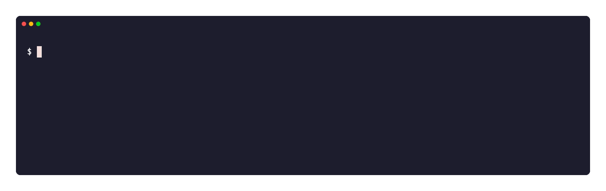
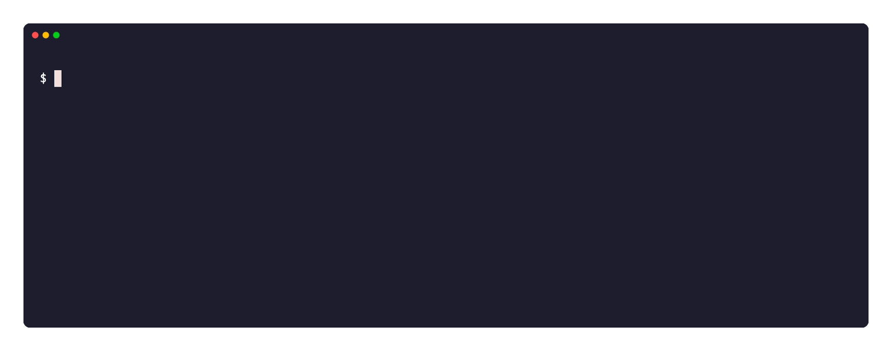
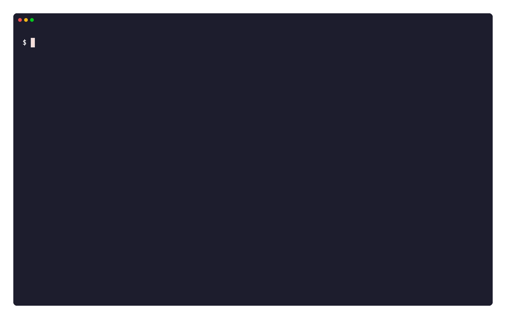
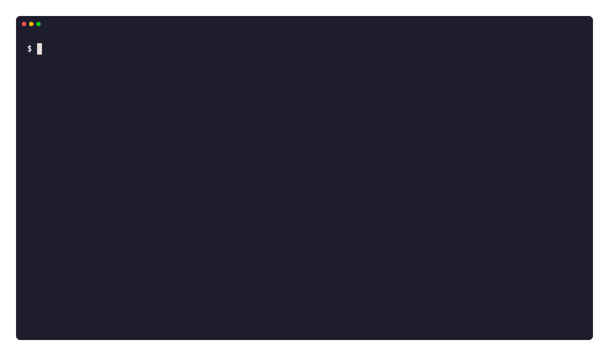
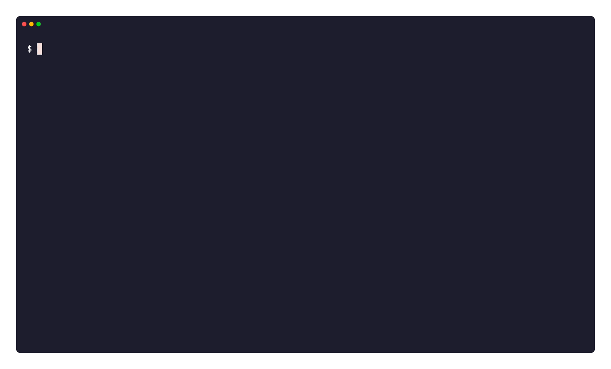

[English](README.md) | **한국어**

# edc

`edc`는 **everyday carry**의 줄임말입니다. everyday carry는 주머니에 넣고 다니면서 가장 먼저 꺼내 쓰는 작은 도구 모음을 뜻합니다. `edc`는 SE와 SRE가 terminal에서 그렇게 쓰는 도구입니다.

장애가 나면 첫 질문은 하나입니다. 원인이 내 쪽인지, 네트워크인지, 상대편인지. `edc`는 명령 하나로 답합니다. DNS, TCP, TLS, HTTP, route, ping, interface, socket을 한 번에 확인하고 결과를 모두 같은 형식으로 출력합니다. Linux와 macOS의 host resource와 host 정보도 함께 보여 주며, 네트워크 응답성(RPM)과 처리량도 잽니다. macOS는 `networkQuality`를 실행하고, Linux는 IETF responsiveness draft를 따르는 내장 측정을 씁니다.

진단 command는 read-only입니다. `watch fs`는 `--exec`나 `--rules`로 지정한 커맨드를 실행할 수 있습니다. 기본 관측은 원인을 찾는 데서 멈춥니다. DNS flush, interface reset, firewall 변경 같은 자동 복구를 하지 않으므로 운영 중인 host에서도 그대로 씁니다.


한 번 실행에 3초쯤 걸립니다. 각 줄은 probe 이름, 대상, 결과를 같은 열에 맞추므로 열 하나만 따라 내려가면 실패한 probe가 보입니다.

데모 화면은 기본 언어인 영어입니다. `EDC_LANG=ko`를 지정하면 한국어로 나옵니다. [언어](#언어)를 보십시오.

각 데모의 소스는 [`docs/tape/`](docs/tape) 아래 `.tape` 파일입니다. `vhs docs/tape/doctor.tape`처럼 실행하면 다시 만듭니다.

## 설치

script로 최신 release를 설치합니다. script는 운영체제와 architecture를 읽고, SHA-256을 확인한 다음 실행 파일을 설치합니다.

```bash
curl -fsSL https://raw.githubusercontent.com/x-mesh/edc/main/install.sh | sh
```

script는 Linux에서는 `edc`를 `/usr/local/bin`에, macOS에서는 `~/.local/bin`에 설치합니다. Linux의 `trace`와 `capture`는 root가 필요하고, `sudo`의 `PATH`에는 보통 `/usr/local/bin`만 있기 때문입니다. 일반 사용자가 설치 디렉터리에 쓸 수 없으면 script는 복사할 때만 `sudo`를 씁니다. root가 `/usr/local/bin`에 쓸 수 없으면 `~/.local/bin`으로 전환합니다. 다른 디렉터리를 반드시 사용하려면 `BINDIR`을 지정합니다. 이전 버전을 받으려면 `EDC_VERSION`을 지정합니다.

```bash
curl -fsSL https://raw.githubusercontent.com/x-mesh/edc/main/install.sh | BINDIR="$HOME/.local/bin" sh
curl -fsSL https://raw.githubusercontent.com/x-mesh/edc/main/install.sh | EDC_VERSION=0.1.0 sh
```

이전 script는 Linux에서도 `edc`를 `~/.local/bin`에 설치했습니다. Ubuntu는 `PATH`에서 `~/.local/bin`을 `/usr/local/bin`보다 앞에 두므로, 이 옛 파일이 남아 있으면 계속 옛 버전이 실행됩니다. 그래서 script는 옛 파일이 `edc`이면 지웁니다. script를 실행한 사용자의 home과, `sudo`로 실행했다면 `sudo`를 실행한 사용자의 home을 확인합니다. 다른 사용자의 home에 있는 파일은 `sudo rm /home/<user>/.local/bin/edc`처럼 직접 지웁니다.

설치 디렉터리가 `PATH`에 없으면 script가 사용 중인 shell을 판단해 그 디렉터리를 추가하는 명령을 출력합니다. `EDC_MODIFY_PATH=1`을 지정하면 script가 `~/.zshrc`, `~/.bashrc` 같은 shell 시작 파일에 직접 한 줄을 추가하며, 이미 있으면 다시 넣지 않습니다. 지금 열려 있는 shell에는 새 `PATH`가 반영되지 않으므로, 새 shell을 열거나 script가 출력한 명령을 실행합니다.

```bash
curl -fsSL https://raw.githubusercontent.com/x-mesh/edc/main/install.sh | EDC_MODIFY_PATH=1 sh
```

release에는 Linux와 macOS의 `amd64`, `arm64` 실행 파일이 들어 있습니다.

## 업데이트

`edc update`는 최신 release를 읽고 SHA-256을 확인한 다음 실행 중인 파일을 바꿉니다.

```bash
edc update           # 확인한 다음 교체
edc update --check   # 두 버전만 출력
edc update --yes     # 확인 생략
```

`edc`는 새 파일을 기존 파일 옆에 쓰고 이름을 바꿉니다. 내려받기가 실패하면 기존 실행 파일이 그대로 남습니다. 디렉터리에 쓸 권한이 없으면 install script처럼 새 파일의 복사와 이름 바꾸기만 `sudo`로 합니다. 내려받기와 checksum 확인은 사용자 권한으로 합니다. 확인 화면에 `권한 sudo`가 나오고, 암호가 필요하면 `sudo`가 한 번 묻습니다. `sudo`가 없거나 실패하면 내려받기 전에 exit code `3`으로 멈춥니다.

## 빌드

Go 1.25 이상이 필요합니다. 실시간 화면은 다음 dependency를 씁니다.

- `charm.land/bubbletea/v2`
- `charm.land/bubbles/v2`
- `charm.land/lipgloss/v2`

```bash
make build VERSION=0.1.0-dev
./bin/edc version
```

`edc`를 `~/.local/bin`에 설치합니다.

```bash
make install VERSION=0.1.0-dev
~/.local/bin/edc version
```

다른 경로에 설치하려면 `PREFIX`나 `BINDIR`을 지정합니다.

```bash
make install PREFIX=/usr/local
```

## 언어

`edc`는 기본으로 영어를 씁니다. 한국어와 일본어도 함께 담고 있습니다.

언어는 설정 파일에서 정합니다. Linux와 macOS 모두 `$XDG_CONFIG_HOME/edc/config.toml`이 설정되어 있으면 그 경로를, 아니면 `~/.config/edc/config.toml`을 읽습니다.

```toml
lang = "ko"
```

`config.toml`이 없으면 Linux는 `~/.config/edc/config.yaml`, macOS는 `~/Library/Application Support/edc/config.yaml`을 계속 읽습니다. `edc setup`은 기존 값을 유지한 채 새 TOML 파일을 저장하며 YAML 파일은 그대로 둡니다.

한 번만 다른 언어로 보려면 `EDC_LANG`을 씁니다. 설정 파일보다 우선합니다.

```bash
EDC_LANG=ja edc where
```

`en`, `ko`, `ja`를 받습니다. `ko_KR.UTF-8` 같은 locale 이름을 주면 앞의 언어 부분만 봅니다. 모르는 값은 영어로 내려가고, 어떤 언어에 빠진 메시지도 영어로 내려갑니다.

## Command 기본값

같은 config file에 반복 실행해도 안전한 command 기본값을 둘 수 있습니다. 우선순위는 built-in, config, 명시한 CLI option 순서입니다. 모르는 key, 잘못된 type이나 범위가 있으면 조용히 무시하지 않고 command 실행 전에 exit code `2`로 멈춥니다.

terminal에서 `edc setup`을 실행하면 file을 만들거나 수정하는 wizard가 열립니다. section별로 설정하고 Enter로 기존 값을 유지하며, optional 값은 `!clear`로 제거합니다. 전체 config를 미리 보여 준 뒤 확인을 받아 mode `0600`으로 atomic 저장합니다. config directory는 mode `0700`이며 취소하면 exit code `4`입니다.

아래 TOML 예시는 Linux와 macOS에 공통으로 적용됩니다.

```toml
lang = "ko"

[defaults.common]
timeout = "15s"
verbose = false
redact = false

[defaults.doctor]
profile = "default"

[defaults.tls]
min_days = 14

[defaults.capture]
duration = "15s"
count = 500

[defaults.remote]
connect_timeout = "10s"
output_limit = 65536
parallel = 0

[defaults.update]
timeout = "60s"

[defaults.quality]
timeout = "30s"
server = ""

[defaults.log]
stream = "both"
output = ""
command_display = "full"
max_size_mb = 10
keep_files = 3
restart = "never"
max_restarts = 3
restart_delay = "5s"
timeout = "0s"
kill_after = "5s"
```

command별 값은 `defaults.common`을 덮습니다. positional target, URL, host, remote group과 `yes`, `force`, `dry-run`, `list`, `check` 같은 action option은 저장하지 않습니다. 저장하는 remote inventory와 recipe는 absolute path여야 합니다. 빈 path 값은 해당 기본값을 사용하지 않는다는 뜻입니다.

Setup wizard는 `edc log`의 저장 경로를 비워두고 실행별 파일을 자동 생성하도록 추천합니다. 직접 지정한 경로의 상위 디렉터리는 이미 있어야 합니다. 이전 추천값인 `edc.log` 경로는 상위 디렉터리 자동 생성을 계속 지원합니다.

## 빠른 시작

```bash
# 실시간 host resource 대시보드 (q로 종료)
./bin/edc top
# 표를 흘려 보내는 기존 출력
./bin/edc top --interval 2s --count 10
# sample당 한 줄 JSON
./bin/edc top --count 5 --json -

# system/network/disk 정보와 public IP
./bin/edc info
# 외부 ipinfo.io 요청 없이 실행
./bin/edc info --public=false

# 기본 종합 진단
./bin/edc doctor https://example.com

# redaction을 적용한 machine-readable report 저장 (파일 mode 0600)
./bin/edc doctor --redact --json report.json https://example.com
./bin/edc report show report.json
# 두 report 비교 (악화된 probe가 있으면 exit 1)
./bin/edc report diff before.json after.json

# bandwidth/responsiveness 측정을 포함한 종합 진단
./bin/edc doctor --profile full --timeout 60s example.com

# 개별 probe
./bin/edc dns lookup example.com
./bin/edc dns compare example.com
./bin/edc tcp check example.com:443
./bin/edc tls check example.com:443
./bin/edc tls check --min-days 14 example.com:443
./bin/edc http check https://example.com
./bin/edc http check --expect-status 200 https://example.com
./bin/edc net route example.com
./bin/edc net ping example.com
./bin/edc net trace example.com
./bin/edc net interfaces
./bin/edc listen              # 열려 있는 포트, --unix나 --all로 unix socket 포함
./bin/edc listen --watch -i 0.5 --duration 10s
./bin/edc quality --timeout 60s
./bin/edc quality --server https://example.com/.well-known/nq   # 응답성 config URL

# 페이지 상태 반복 확인; --duration을 생략하면 Ctrl-C까지 실행
./bin/edc watch http -i 0.1 --duration 10s https://example.com

# 어느 지역이 가깝고 이 망은 어떤 모습인지
./bin/edc where
./bin/edc where --provider aws --count 5

# shell completion
source <(./bin/edc completion zsh)

# 최신 release로 업데이트
./bin/edc update --check
```

공통 option은 `--timeout`, `--json <path|->`, `--verbose`, `--redact`입니다. Go `flag` 규칙에 따라 option은 target 앞에 둡니다.

`edc info`는 public IP를 기본으로 ipinfo.io에 조회합니다. 3초 안에 응답이 없으면 요청을 멈추고 그 줄을 빼고 출력합니다. 요청을 끄려면 `--public=false`를, 제한 시간을 바꾸려면 `--timeout`을, 실패 원인을 보려면 `-v`를 씁니다.

`edc info`는 메모리 상태, 프로세스 요약, 진단 기능의 지원 여부도 표시합니다. Linux의 사용량은 `MemTotal - MemAvailable`이며, 제공되는 캐시·buffer·회수 가능한 slab 값을 함께 보여 줍니다. macOS의 회수 가능량은 Mach의 free·inactive page를 기준으로 추정하며, 파일 기반 메모리와 압축된 물리 메모리를 구분합니다. 세부 카운터는 서로 겹칠 수 있으므로 합산하지 않습니다. 이 값만으로 메모리 압박을 판정하지 않습니다.

프로세스 요약에는 관측한 프로세스 수, thread 수와 그 수집 범위, RSS가 높은 상위 3개를 표시합니다. 프로세스별 공유 page가 중복될 수 있으므로 RSS를 합산해 host 메모리 사용량으로 해석하지 않습니다.

기본 출력은 관련 값을 한 행에 묶습니다. `-v`를 주면 긴 커널 정보, 메모리 계산 기준, 공유 page 주의사항도 표시합니다.

진단 지원 여부는 현재 프로세스의 I/O 접근, PSI, eBPF 상세 조건을 확인합니다. 다른 PID의 접근 권한은 다를 수 있습니다. Linux의 eBPF 확인은 kernel BTF와 effective capability만 읽으며 program을 불러오거나 attach하지 않습니다. `prerequisites met`는 실제 attach 성공을 보장하지 않습니다. 미지원·권한 부족·확인 실패는 이유와 함께 표시합니다.

메모리나 프로세스 수집에 실패하면 오류를 표시하고 종료 코드 `1`을 반환합니다.

Linux에서는 `edc info`의 `Network Limits`에 conntrack 사용량과 한도, 임시 port 범위와 예약 port, accept/SYN 대기열 한도, socket buffer 상한, 패킷 처리 backlog/budget, neighbor 한도, forwarding과 `rp_filter`를 요약합니다. `-v`는 TCP buffer 설정과 개별 sysctl 이름, 읽지 못한 이유도 표시합니다. 값이 없거나 권한이 부족하면 `unavailable`로 표시하며, macOS에서는 이 항목을 `unsupported`로 표시합니다. 설정값만으로 연결 실패를 판정하지 않습니다.

### 이름 조회



기본적으로 터미널과 JSON에 실제 IP 주소를 보여줍니다. `--redact`를 주면 `<ip:...>`로 가립니다.

`edc dns compare example.com`은 system resolver와 `1.1.1.1`을 비교합니다. 다른 DNS 서버를 쓰려면 `--resolver IP[:port]`를 반복해서 지정합니다. A, AAAA, CNAME, 응답 상태를 비교하고, 직접 지정한 resolver의 TTL도 보여 주되 TTL 차이만으로 불일치 처리하지는 않습니다. 응답이 다르면 WARN, system 조회가 실패하면 FAIL입니다.

### 연결 확인



실패한 probe는 phase와 cause를 ERROR 블록으로 보여 주고 exit code `1`을 돌려줍니다.

`edc watch http -i 0.1 https://example.com`은 Ctrl-C까지 페이지를 반복 확인합니다. `-i`는 초 단위 소수(최소 `0.1`)나 `100ms` 같은 duration을 받으며, `--duration 1m`으로 종료 시각을 정할 수 있습니다. 매 sample에 HTTP status, 읽은 body byte(최대 10 MiB), 소요 시간과 수집된 DNS/TCP/TLS/TTFB 시간을 표시합니다. DNS의 IP 집합이 바뀌면 새 목록을 보여 줍니다. 완료한 표본이 있으면 마지막에 min/avg/p95/max 지연과 최장 연속 실패 시간을 요약합니다. `--json <path|->`는 마지막 요약을 포함한 JSON Lines를 출력합니다. 요약에는 `observation_status`(`observed` 또는 `no_samples`)와 `stop_reason`(`duration` 또는 `cancelled`)이 추가됩니다.

완료한 표본이 없으면 텍스트 요약은 관측 종료 이유를 설명하고 지연 통계를 생략합니다. 이때 대상의 상태를 판단할 수 없습니다. 완료한 표본 없이 관측 시간이 끝나면 exit code는 `2`, 취소하면 `4`입니다. 완료한 표본이 있으면 기존 정책을 유지합니다. 실패한 표본이 있으면 `1`, 없으면 취소한 경우에도 `0`입니다.

`edc listen --watch`는 현재 listener를 한 번 출력한 뒤 socket의 생성·종료·소유 process 변경을 알려 줍니다. 변경 줄은 터미널에서 반전 표시합니다. 같은 interval·duration 옵션을 받으며, `--json`은 초기 snapshot·event·요약을 JSON Lines로 출력합니다.

기본·상세 표의 범위 열과 watch 변경 줄은 소켓이 바인딩한 주소를 loopback, 모든 인터페이스, 특정 주소, Unix, 알 수 없음으로 구분합니다.

wildcard의 모든 인터페이스는 관측한 주소 계열의 바인딩을 뜻합니다. 외부 접근 가능 여부, 방화벽 규칙, IPv6 dual-stack 동작을 판단하는 값은 아닙니다.

macOS의 lsof는 Unix 소켓 상태를 제공하지 않으므로 Unix 소켓 목록은 근사치입니다.

### 파일 감시와 action (Linux·macOS)

`edc watch fs`는 기본으로 현재 디렉터리 바로 아래의 변경을 감시하고 출력합니다. `--recursive`로 하위 디렉터리까지 감시하며, 새로 생성되거나 들어온 디렉터리도 등록합니다. 시작할 때 이미 있던 파일은 create 이벤트로 출력하지 않습니다. 디렉터리 symlink는 따라가지 않습니다.

```bash
edc watch fs
edc watch fs ./src --recursive
edc watch fs --event create --match text.txt --exec 'git-kit pull'
edc watch fs ./src --recursive --event modify --match '**/*.go' --exec 'go test ./...'
edc watch fs --rules docs/examples/watch.yaml --dry-run
edc watch fs --duration 1m --json events.jsonl
```

이벤트는 `create`, `modify`, `remove`, `rename`입니다. `rename`의 path는 원래 이름이며 감시 범위 안의 새 이름은 create로 나타날 수 있습니다. 파일 읽기(access)와 metadata-only 변경은 감지 대상이 아닙니다. `--event`는 쉼표로 여러 이벤트를 받으며 `--match`는 감시 루트 기준 glob입니다. `*.go`는 바로 아래 파일, `**/*.go`는 모든 깊이의 파일에 일치합니다. 하위 경로를 실제로 감시하려면 `--recursive`도 지정합니다.

기본으로 `.git/**`를 제외하며 `--exclude 'build/**'`처럼 제외 glob을 반복할 수 있습니다. JSON 출력 파일과 stdout으로 연결된 일반 파일도 감시에서 제외하여 출력이 다음 이벤트를 만들지 않게 합니다. `--event`와 `--match`는 출력과 action에 공통으로 적용됩니다. rule 파일을 생략하면 기본 action은 없습니다.

rule 파일은 알 수 없는 key를 거부하는 YAML 문서 하나입니다. 아래 예시는 현재 디렉터리를 감시합니다. `directory`를 지정하면 rule 파일이 있는 디렉터리 기준으로 해석하며, CLI의 directory 인자가 우선합니다. rule의 `cwd`는 감시 루트 기준이고 기본값은 감시 루트입니다.

```yaml
recursive: true
exclude: [build/**]
rules:
  - name: pull-on-trigger
    events: [create]
    match: text.txt
    command: [git-kit, pull]
    debounce: 200ms
    timeout: 30s
  - name: test-on-go-change
    events: [create, modify]
    match: "**/*.go"
    command: [go, test, ./...]
    debounce: 500ms
```

```bash
edc watch fs --rules watch.yaml
```

`--exec`는 `/bin/sh -c`로 실행하고 YAML의 `command`는 shell 없이 argv 그대로 실행합니다. shell alias는 불러오지 않으므로 실행 가능한 command 이름을 사용합니다. 파일명은 command 문자열에 자동 삽입하지 않으며 `EDC_WATCH_ROOT`(절대 경로), `EDC_WATCH_PATH`(상대 경로), `EDC_WATCH_EVENT`, `EDC_WATCH_RULE` 환경변수로 전달합니다. shell에서 파일명을 사용할 때는 `"$EDC_WATCH_PATH"`처럼 인용합니다.

전체 action은 한 번에 하나씩 실행합니다. 기본 debounce는 200ms이며 rule별 마지막 이벤트를 기준으로 연속 이벤트를 묶습니다. 실행 중 추가 이벤트는 rule당 한 건으로 묶어서 실행 종료 후 다시 실행합니다. `--dry-run`은 일치한 action을 표시하되 실행하지 않습니다. 커맨드가 감시 대상 파일을 변경하면 다시 조건에 맞을 수 있으므로 출력 경로를 제외하거나 match 범위를 좁힙니다.

action의 stdin은 연결하지 않습니다. 기본 timeout은 30s이며 `--debounce`와 `--timeout`은 rule에 값이 없을 때의 기본값입니다. stdout·stderr를 합쳐 최대 64 KiB까지 결과에 표시합니다. 실패나 timeout 뒤에도 감시는 계속하며, 실패한 action이 있으면 감시 종료 코드가 `1`입니다. `Ctrl-C`나 `--duration` 만료 시 실행 중인 action의 process group을 종료하고 대기 중인 action은 실행하지 않습니다. 변경이 없는 정상 감시는 종료 코드 `0`, 옵션·출력 오류는 `2`입니다. 감시 루트 삭제·이름 변경, watcher 오류나 이벤트 overflow는 관측이 불완전하므로 오류로 종료합니다.

`--json`은 `ready`, `event`, `action_start`, `action_result`, `summary`를 JSON Lines로 씁니다. action 출력은 `action_result.output` 안에 있어 JSON stream을 섞지 않습니다. 감시는 로컬 filesystem을 대상으로 하며 저장 방식에 따라 이벤트가 합쳐지거나 여러 번 발생할 수 있습니다. 모든 파일 작업을 기록하는 audit 기능은 아닙니다.

### 경로와 interface


## 어디에 있는가

`edc where`는 두 질문에 한 번에 답합니다. 이 host에서 어느 클라우드 지역이 가까운지, 그리고 이 망이 어떤 모습인지.

```bash
./bin/edc where
./bin/edc where --provider aws        # 사업자 하나만
./bin/edc where --count 5 -v          # 더 여러 번 재고 사업자별로 모두 보기
```

`edc`는 지역마다 공개 endpoint에 TCP handshake만 열고 끊습니다. 요청을 보내지 않고 본문도 읽지 않으므로 값에는 왕복 시간만 남습니다. 이름은 한 번만 풀고 그 주소로 연결해 DNS 시간이 거리 값에 섞이지 않게 합니다.

표는 endpoint를 도시로 묶고 도시마다 가장 빠른 사업자를 남깁니다. 사업자별 값을 모두 보려면 `-v`를 씁니다.

| 사업자 | endpoint |
|---|---|
| `aws` | `s3.<region>.amazonaws.com` |
| `gcp` | `storage.<region>.rep.googleapis.com` |

Azure는 넣지 않았습니다. 리전 이름이 붙은 공개 주소가 실제로 그 리전에서 끝나지 않아 값이 거리를 따르지 않습니다.

`edc where`는 public IP와 ASN, anycast가 고른 Cloudflare PoP, 그리고 로컬 망의 모습도 함께 보여 줍니다.

- NAT 뒤인지, 아니면 interface가 public 주소를 직접 쓰는지
- carrier-grade NAT 뒤인지. `100.64.0.0/10` 대역이 그 표시입니다
- tunnel을 지나는지. 기본 경로 interface가 그 표시입니다

terminal에서는 몇 곳을 확인했는지 진행 줄로 보여 줍니다. `q`로 취소합니다.

기본 화면에는 주소를 그대로 씁니다. `--redact`를 주면 화면과 JSON 출력에서 가립니다.



데모 화면은 public IP를 `222.XXX.XXX.XXX`로 가리고, route 주소를 사설 예시 주소로 바꿨습니다.

`edc`는 확인한 것만 밝힙니다. 지터로 회선 종류를 짐작하지 않습니다. 지터는 숫자로 남기고 판단은 사용자에게 맡깁니다.

## Probe 임계값

`edc tls check`는 인증서 만료가 30일보다 적게 남으면 warning을 냅니다. `--min-days`를 지정하면 그보다 이른 만료를 실패로 처리합니다.

`edc http check`는 4xx 응답에 warning을, 5xx 응답에 실패를 냅니다. `--expect-status`를 지정하면 그 code만 통과하고 나머지는 실패입니다.

대상에 scheme이 없으면 `edc http check`는 `http://`를 붙입니다. `edc http check naver.com`은 `http://naver.com`을 요청하고 redirect를 따라갑니다. `url` metric에는 실제로 요청한 주소가 남습니다. TLS endpoint를 바로 확인하려면 `https://`를 씁니다.

```bash
./bin/edc tls check --min-days 14 example.com:443
./bin/edc http check --expect-status 200 https://example.com/health
```

실패는 exit code `1`을 돌려줍니다. 이 option을 cron에 넣으면 synthetic check가 됩니다.


두 데모 모두 통과 한 번과 임계값 실패 한 번을 보여 줍니다.

## Report 비교

`edc report`는 edc 진단 명령이 `--json`으로 저장한 **edc 진단 결과**를 읽고 비교합니다. `doctor`뿐 아니라 같은 report 형식을 사용하는 다른 edc 진단 명령의 결과도 지원합니다. 일반 JSON 파일이나 `report diff`가 생성한 비교 JSON은 지원하지 않습니다. `edc log`가 저장한 명령 출력 텍스트와는 별개입니다. `edc report list [directory]`는 지정한 디렉터리(기본값: 현재 디렉터리)의 유효한 JSON report를 실행 시각이 최신인 순서로 나열하며, 실행 시각과 PASS/WARN/FAIL/SKIP 개수를 보여 줍니다. 하위 디렉터리는 검색하지 않습니다.

```bash
./bin/edc doctor --json report.json https://example.com
./bin/edc report list
./bin/edc report show report.json
```

경로 없이 `edc report show`나 `edc report diff`를 실행하면 최근 report 최대 20개 중에서 선택하거나 다른 JSON 파일 경로를 직접 입력할 수 있습니다. report가 없으면 저장 예시를 안내합니다.

`edc report diff`는 두 JSON report를 probe 이름으로 맞춰 비교합니다. probe마다 status 변화와 scalar metric 차이를 보여 줍니다.

```bash
./bin/edc doctor --json before.json https://example.com
./bin/edc doctor --json after.json https://example.com
./bin/edc report diff before.json after.json
./bin/edc report diff --json diff.json before.json after.json
```

보고서에는 schema version `1.0`, tool name `edc`, 비어 있지 않은 tool version과 run ID, 유효한 0이 아닌 실행 시작 시각이 필요합니다.

`results`와 summary 객체가 있어야 합니다. 빈 결과는 `null`과 `[]`를 모두 허용하며, 알 수 없는 확장 필드도 허용합니다.

각 결과에는 probe 이름과 `pass`, `warn`, `fail`, `skip` 중 하나의 status가 필요합니다. 실행 시간과 summary 개수는 음수일 수 없으며, summary는 결과와 일치해야 합니다. 잘못된 보고서 입력의 exit code는 `2`입니다.

`STATUS SAME`과 `STATUS CHANGED`는 상태만 비교합니다. JSON의 `same`과 `changed`도 같은 기준을 유지합니다.

status가 pass에서 warn이나 fail로, 또는 warn에서 fail로 바뀌면 그 probe를 `WORSE`로 표시합니다. 악화된 probe가 하나라도 있으면 exit code는 `1`입니다.

두 보고서에 모두 있는 scalar metric과 실행 시간의 차이는 별도로 표시합니다. 배열, 객체, 추가되거나 삭제된 metric 키는 비교하지 않으므로, 차이가 표시되지 않아도 모든 측정값이 같다는 뜻은 아닙니다. 접힌 뷰어에는 scalar와 실행 시간의 차이 개수가 나옵니다.

머리말에는 양쪽 target URL, target host, 수집 hostname이 나옵니다. 서로 다르면 안내를 표시하고 비교를 계속합니다. 없는 식별 정보는 확인 불가로 표시합니다. JSON 비교 결과의 각 측에는 수집 `hostname`과 별도로 선택 필드 `target_url`과 `target_host`가 추가됩니다.

## Report 뷰어

stdin과 stdout이 모두 terminal이면 `edc report show`와 `edc report diff`는 전체 화면 뷰어를 엽니다.

| key | 동작 |
|---|---|
| `f` | 필터 변경 |
| `e` | 상세 펼치기와 접기 |
| `↑` `↓` `PgUp` `PgDn` | 스크롤 |
| `q` | 종료 |

`edc report show`의 필터는 전체, 실패와 경고, 실패만 순서로 바뀝니다. `edc report diff`의 필터는 전체, 상태가 바뀐 것, 악화된 것 순서로 바뀝니다.

뷰어는 화면에 출력을 남기지 않습니다. exit code는 그대로입니다. 파이프, 파일, `--json`은 기존 출력을 받습니다.



데모는 뷰어를 열어 필터를 바꾸고 상세를 펼친 다음, 두 report를 비교합니다.

## Top 임계값

`edc top`은 색을 둘만 씁니다. 노란색은 경고, 빨간색은 위험입니다. 정상 값은 terminal 기본색으로 두므로 색이 붙은 값만 살피면 됩니다.

표는 load, `usr%`, `sys%`, `i/o`, `mem_%`에 색을 넣습니다. 대시보드는 이 값에 더해 `hot core`, `await`, `err`, `drop`, pressure 값에도 색을 넣습니다.

load 임계값은 host의 core 수를 따릅니다.

| 값 | 경고 | 위험 |
|---|---|---|
| load | 0.7 × cores | 1.0 × cores |
| usr%, sys% | 70 | 90 |
| i/o | 10 | 25 |
| mem_% | 90 | 95 |
| await | 20 ms | 50 ms |
| err, drop | 1/s | 50/s |
| psi | 10 | 25 |
| hot core | 90 | — |

`hot core`는 core 하나의 사용률이므로 90부터 경고만 주고 위험 단계가 없습니다. core가 여럿이면 하나가 포화해도 host 전체에는 여유가 있습니다.

대시보드는 `iops`, `busy%`, `swap/s`, `steal%`, `blocked`, `queue`, 바이트·패킷·TCP 속도, `signal` 열에는 색을 넣지 않습니다. 임계값이 없거나 색 없이도 수준이 드러나는 값입니다. 집계 `busy%`는 바쁜 disk가 여럿이면 100을 넘으므로 고정 임계값이 잘못된 신호를 줍니다. `cores` 막대는 `.`, `:`, `*`, `#`로 수준을 보여 줍니다.

색을 끄려면 `NO_COLOR`를 설정합니다. 파이프와 파일에는 색이 들어가지 않습니다.

`edc info`는 disk마다 막대를 그립니다. 막대는 `mem_%`와 같은 임계값을 쓰고 한 칸이 5퍼센트입니다. 막대는 색 없이도 수준을 보여 주므로 파이프에서도 정보가 남습니다.

`edc info`는 disk 사용량을 전체 크기에서 남은 공간을 뺀 값으로 셉니다. macOS에서는 여러 APFS volume이 container 하나를 나눠 쓰므로, volume 하나의 `Used` 열만 보면 다른 volume이 차지한 공간이 빠집니다.

`edc info`는 저장 장치를 쓰는 file system만 보여 줍니다. `tmpfs`, `overlay`, `snap`이 붙이는 읽기 전용 image는 숨깁니다. 램을 쓰거나 같은 disk를 두 번 세기 때문입니다. loop device 자체는 숨기지 않으므로 직접 붙인 disk image는 그대로 나옵니다.

macOS에서 `edc`는 memory 사용량을 Mach `host_statistics64` 호출로 읽습니다. free, speculative, inactive page를 빼는데, 이는 Linux의 `MemAvailable`과 같은 기준입니다. `top`의 `PhysMem` 줄은 cache를 포함하므로 97퍼센트 위에 머뭅니다.

## Top 대시보드

stdin과 stdout이 모두 terminal이면 `edc top`은 전체 화면 대시보드를 엽니다. 대시보드에는 `--count` 제한이 필요 없습니다.

| key | 동작 |
|---|---|
| `q` | 종료 |
| `p` | 일시정지와 재개 |
| `+` | interval 늘리기 |
| `-` | interval 줄이기 |
| `1`, `c`, `m`, `d`, `n` | 전체, CPU, memory, disk, network 열로 전환 |
| `s` | Linux pressure 열로 전환 |
| `v` | 박스 화면으로 돌아가기 |
| `f` | 선택한 행의 signal 보기로 이동하고, 한 번 더 누르면 process 후보 선택. 필터가 있으면 process 보기로 전환 |
| `Tab` | 이력 탐색과 process 후보 선택 사이 이동 |
| `?` | 도움말 표시. 화살표로 스크롤하고 `Esc`로 닫기 |
| `/` | process 필터 입력: command 이름이나 PID, 쉼표로 구분 |
| `Esc` | 도움말이나 후보 선택 닫기. 그 외에는 process 필터 해제 |
| `↑`, `↓`, `PgUp`, `PgDn`, `End` | 과거 행 선택, 한 화면씩 이동, 실시간 행 추적 재개 |
| `Enter` | 선택한 시점의 상세 표시. 후보 선택 중에는 선택한 PID에 초점 |
| `h` | 최근 60초의 load, CPU, iowait, memory 최고치를 각각 시각과 함께 표시 |

기본 표의 `signal` 열은 load, CPU, iowait, memory, disk await, network errors·drops 중 가장 심각한 항목과 추가 개수를 보여 줍니다. network errors·drops는 초당 1개부터 경고로 셉니다. 패킷 수는 network 보기에서 확인합니다. 과거 행을 선택해도 수집은 계속되며 `End`로 최신 행을 다시 따라갑니다. 수집이 잠시 실패하면 마지막 행을 유지하고 다음 interval에 다시 시도합니다.

기본 표는 terminal 폭에 맞춰 열을 늘립니다. 80열보다 넓으면 다음 순서로 열을 추가합니다.

| terminal 폭 | 추가되는 열 |
|---|---|
| 84 | hot core |
| 96 | disk IOPS, `await` |
| 110 | packet in/out |
| 120 | network errors·drops |
| 125 | disk `busy` |
| 143 | CPU·memory·I/O pressure(`psi`) |
| 149 | memory swap out(`swap`) |
| 161 | listen queue overflow(`listen`), softnet drop(`soft`) |
| 167 | conntrack 사용률(`ct%`) |

`signal` 열은 13~16칸을 씁니다. 경고를 적어도 하나와 나머지 경고의 개수를 표시할 수 있는 폭입니다. 남는 폭은 다른 열이 나눠 가져서, 표가 terminal 오른쪽 끝까지 찹니다. 제목 줄도 폭에 여유가 있으면 OS 이름, memory 크기, CPU 모델을 함께 표시합니다. 제목 오른쪽 끝에는 보기와 `live` 또는 `history`를 표시하고, 폭에 여유가 있으면 edc 버전도 붙입니다. 폭이 줄면 추가한 열을 바로 뺍니다.

80열보다 좁으면 전체 보기에는 CPU, memory, load, signal을 남깁니다. 다른 보기에서도 폭에 맞지 않는 열은 뺍니다. 최소 크기는 24열·8행이며, 작은 terminal에서는 도움말을 스크롤할 수 있습니다.

`--split`을 쓰면 여러 보기를 한 화면에 동시에 봅니다. 보기마다 박스가 하나씩 생기고, 박스 안에는 그 보기의 최근 sample 표가 들어갑니다.

`--split`은 `cpu`, `mem`, `disk`, `net`, `psi` 이름을 쉼표로 이어 받으며, 적은 순서대로 박스를 배치합니다. 목록 없이 `--split`만 쓰면 다섯 박스를 모두 보이고, `--split none`은 박스 없이 단일 보기로 시작합니다. 빈 값, 모르는 이름, 중복 이름은 exit 2로 끝납니다.

설정 파일의 `defaults.top.split`에 같은 문법으로 목록을 적으면 대시보드를 매번 그 목록으로 시작합니다. 명령줄에 직접 준 `--split`이 설정 값보다 우선합니다.

박스는 적은 순서를 지킵니다. terminal 폭에 들어가는 가장 적은 줄 수를 쓰고, 그 줄 수 안에서 가장 넓은 줄이 가장 좁아지도록 박스를 나눕니다. 박스 줄들은 높이를 똑같이 나눠 가집니다. 모든 박스에서 `signal` 열을 빼고, 선택한 시각의 signal을 박스 아래 한 줄로 한 번만 보입니다. cpu 박스가 화면에 있으면 mem과 psi 박스에서 `load`를 빼고, mem 박스가 있으면 psi 박스에서 `mem%`를 뺍니다. 상세, 최고치, process 패널은 단일 보기와 같은 방식으로 그 아래에 놓입니다. 같은 줄의 박스는 같은 시각의 행을 나란히 보이므로 `time` 열은 줄의 첫 박스에만 있습니다.

선택한 행은 모든 박스가 공유합니다. 방향키와 `End`는 모든 박스를 함께 움직이고, `PgUp`과 `PgDn`은 박스 하나의 데이터 행 수만큼 이동합니다. `1`, `c`, `m`, `d`, `n`, `s`를 누르면 박스 화면을 떠나고, `v`를 누르면 돌아옵니다.

박스 하나에는 데이터 행이 3개 이상 필요합니다. 박스의 데이터 행이 그보다 적으면 첫 박스를 단일 보기로 보이고 상태 줄에 이유를 안내합니다. terminal보다 넓은 박스는 뒤쪽 열을 빼고 들어갑니다. `steal%`, `retr/s` 같은 선택 열 때문에 박스 줄이 늘어나면 박스에서 선택 열을 뺍니다. 80열·24행 terminal에서 `--split`은 CPU 보기만 보이고, 80열에서 박스 다섯 개를 모두 보이려면 약 33행이 필요합니다.

macOS에서는 `psi` 박스를 생략하고 안내를 보입니다. 설정 파일에 `psi`를 적어도 오류가 아니므로 Mac과 Linux가 같은 파일을 쓸 수 있습니다.

`--split`은 대시보드에서만 동작합니다. 표를 출력하는 실행(`--count`, `--json`, 파이프, `NO_COLOR`)이나 `--process`와 함께 직접 주면 exit 2로 끝납니다. 설정 값은 그런 실행을 막지 않고, `--process`와 함께면 process 보기가 유지됩니다.

disk 보기에는 macOS와 Linux 모두 물리 disk의 IOPS와 평균 `await`가 추가됩니다. Linux에서는 모든 물리 disk의 합산 `busy%`와, memory 보기의 `mem%` 옆 memory pressure도 추가됩니다. 합산 `busy%`는 여러 disk가 동시에 바쁘면 100%를 넘을 수 있습니다. macOS 대시보드는 수집하지 않는 iowait, PSI, disk busy, file descriptor, listen overflow, softnet drop, conntrack, eBPF 지연 열을 숨기고 도움말에 제한을 설명합니다. network 보기의 interface errors·drops는 macOS와 Linux 모두 표시하며, macOS에서는 kernel의 interface 통계(`net.link.generic.ifdata`)에서 읽습니다. memory 보기의 `swap/s`는 kernel이 초당 swap으로 내보낸 byte입니다.

Linux에서는 일부 보기에 선택 열이 더 있습니다. CPU 보기의 `steal%`는 hypervisor가 다른 guest에 CPU를 내준 시간의 비율이고, `blocked`는 지금 I/O를 기다리며 멈춘 작업 수입니다. disk 보기의 `queue`는 진행 중인 I/O 요청의 평균 개수를 물리 disk마다 더한 값입니다. network 보기에는 초당 TCP 재전송 segment(`retr/s`), 보낸 RST(`rst/s`), 실패한 연결 시도(`fail/s`)가 있습니다. 선택 열은 다른 열이 모두 들어가고 `signal`에 13열 이상이 남을 때만 보입니다.

`s`는 Linux pressure 보기입니다. CPU, memory, I/O의 `some avg10`을 퍼센트로 표시하며, 최근 10초 동안 일부 작업이 그 자원을 기다린 시간의 비율입니다. `mem full`과 `io full` 열은 memory와 I/O의 `full avg10`으로, 최근 10초 동안 실행할 수 있는 작업이 모두 동시에 기다린 시간의 비율입니다. CPU 보기의 `hot core`와 ASCII 막대는 코어별 사용률을 보여 주고, 24개보다 많은 코어는 앞 24개만 막대로 표시합니다.

상세 보기에는 CPU 사용률 기준 상위 세 process도 표시합니다. 목록은 관측 주기를 늘리지 않도록 최대 1초마다 백그라운드에서 갱신하며, `--write`가 없으면 대시보드에서만 수집하고 표와 필터 없는 `--json` 출력에서는 수집하지 않습니다. Linux에서는 `/proc/<pid>/stat`의 CPU tick을 직전 갱신과 비교하므로 값은 그 사이 구간의 사용률입니다. macOS에서는 `ps`가 제공하는 최근 감쇠 평균을 씁니다.

기본 process 패널은 CPU 순위로, memory 보기에서는 RSS 순위로 후보를 보여 줍니다. 후보는 3개를 표시하고, terminal이 40행 이상이면 5개를 표시합니다. 패널과 키 안내는 화면 맨 아래에 고정됩니다. 안내 두 줄이 한 줄에 들어가면 한 줄로 합칩니다. terminal이 145열 이상이면 process 패널은 오른쪽으로 가고, 상세·최고치 패널과 키 안내는 왼쪽에 놓입니다. `--process`를 쓰면 process 줄이 길어지므로 위아래로 쌓습니다. CPU 상위 목록을 자르기 전에 두 지표의 상위 5개를 각각 보존하므로 CPU 사용량이 낮은 memory 상위 process도 남습니다. `Tab`으로 후보 선택에 들어가 화살표로 고른 뒤 `Enter`로 해당 PID에 초점을 맞춥니다. 후보를 고르는 동안에는 선택한 시점을 유지하고, `End`로 실시간 이력으로 돌아갑니다.

`signal` 열은 host 경고를 process CPU 후보보다 먼저 보여 줍니다. 후보가 host 경고의 원인이라고 단정하지 않습니다. process CPU는 core 하나가 100%이고, host CPU는 전체 core를 기준으로 합니다.

process 패널과 `PROCESS` 막대에는 선택한 시각을 표시합니다. host 수집이 실패하면 마지막 성공 시각을 함께 표시합니다.

interval은 200ms, 500ms, 1s, 2s, 5s, 10s, 30s, 1m 사이를 오갑니다. 일시정지를 풀면 먼저 새 기준점을 만들고, 그 다음 행부터 rate를 표시합니다.

대시보드는 이전 화면으로 빠져나가며 행을 남기지 않습니다. 대시보드를 유지하며 기록하려면 `--write <DB>`, JSON Lines로 남기려면 `--json`을 씁니다.

다음 경우에는 대시보드 대신 기존 표를 출력합니다.

- `--count`나 `--json`을 지정한 경우
- stdin이나 stdout이 terminal이 아닌 경우
- `NO_COLOR`가 설정된 경우

macOS에서 `edc`는 Mach `host_processor_info` 호출로 kernel에서 core별 CPU tick을 직접 읽고, Linux에서는 `/proc/stat`을 읽습니다. 두 운영체제 모두 모든 열이 interval을 따릅니다.

Linux에서는 `n` 화면에 conntrack 사용률(`ct%`), listen overflow/s(`listen/s`), softnet drop/s(`soft/s`)를 추가합니다. 아래 패널은 선택한 시점의 conntrack entry, TCP socket 수, listen drop·SYN cookie·conntrack drop·UDP 수신 buffer 오류와 softnet budget 초과의 초당 증가량을 보여 줍니다. `↑`/`↓`로 이전 sample을 보고, `Enter`로 당시 설정을 펼치고, `h`로 최근 60초 최대값을 봅니다. `ct%`는 90%부터 경고, 98%부터 위험으로 표시하며 연결 실패가 확인됐다는 뜻은 아닙니다.

수집은 현재 network namespace를 기준으로 하지만 softnet 카운터와 TCP TIME_WAIT 수는 host 전체 값일 수 있습니다. TCP `CurrEstab`는 ESTABLISHED와 CLOSE_WAIT를 포함합니다. socket 수는 임시 port 사용률이 아닙니다. 카운터 읽기 실패·초기화·기준점 부재 시 rate는 `—`로 표시합니다. conntrack 상세 통계는 `/proc/net/stat/nf_conntrack`이 노출될 때 수집하며, 없으면 해당 값만 빠집니다.

`--json`의 `network_limits`에는 namespace, 설정(`settings`), 현재값(`gauges`), 누적값(`counters`), 초당 증가량(`rates`)이 들어갑니다. `counters`와 `rates`에는 `tcp_retrans_segs`, `tcp_out_rsts`, `tcp_attempt_fails`도 있습니다. 각 값에는 `status`와 필요한 경우 `reason`이 있으며, 관측하지 못한 숫자는 생략됩니다. 파일에 저장하면 외부 도구로 실행 후 추이를 분석할 수 있습니다.

## Top JSON 출력

`--json`을 쓰면 sample마다 JSON 객체를 한 줄씩 씁니다. stdout으로 보내려면 `-`를 씁니다. 경로를 주면 mode 0600으로 새 파일을 만듭니다.

```bash
./bin/edc top --count 5 --json -
```

각 줄에는 `time`, `hostname`, `cores`, 초당 byte 단위 network·disk rate, 퍼센트 단위 CPU 값, `load1`, `memory_pct`, 초당 byte 단위 `swap_out_bytes_per_s`가 들어갑니다. macOS와 Linux 모두 network errors·drops와 disk IOPS·await를 내보냅니다. Linux에서는 disk busy, PSI `some avg10`, memory·I/O PSI `full avg10`도 추가되며, `*_health_supported`, `disk_busy_supported`, `psi_supported`가 지원 여부를 표시합니다. `--json`은 표와 헤더를 없앱니다.

## Top 저장과 이력 조회

`--write [path]` 또는 `-w [path]`로 관측값을 로컬 SQLite DB에 누적합니다. 대시보드는 유지하며, `--count`, 파이프, `--json`의 출력 방식은 그대로입니다. `--write`와 함께 쓰면 표에서도 `--process`를 사용할 수 있습니다. `-w`만 주면 Linux는 `~/.local/state/edc/history.db`, macOS는 `~/Library/Application Support/edc/history.db`를 사용합니다. 두 플랫폼 모두 절대 경로인 `XDG_STATE_HOME`이 있으면 `$XDG_STATE_HOME/edc/history.db`를 사용합니다. 기본 디렉터리는 권한 `0700`으로 자동 생성합니다. `-w`나 `--write`를 생략하면 저장하지 않습니다.

```bash
./bin/edc top -w
./bin/edc history list
./bin/edc top -w incident.db
./bin/edc top --process nginx --count 60 -w incident.db
./bin/edc top --count 10 -w incident.db --json samples.jsonl
./bin/edc history list incident.db
./bin/edc history top --metric memory_pct --min 90 incident.db
./bin/edc history top --from 2026-10-05T09:00:00+09:00 --to 2026-10-05T10:00:00+09:00 incident.db
./bin/edc history process --process nginx --metric cpu_pct --min 100 incident.db
./bin/edc history top --run <run-id> --limit 0 --json - incident.db
```

같은 DB를 지정해도 이전 값을 덮어쓰지 않고 별도 실행으로 추가합니다. 실행마다 host 정보, edc version, 수집 조건, 시작·종료 시각, 상태, sample 수를 남깁니다. `unfinished`는 종료 기록이 없는 실행으로, 실행 중이거나 강제 종료된 상태일 수 있습니다. 정상 종료는 대기 중인 기록을 모두 저장하고, 저장 실패는 관측을 중단하며 종료 코드 `1`을 반환합니다. 강제 종료 시 이미 commit된 transaction은 보존됩니다. 새 DB 권한은 `0600`이며 자동 삭제나 회전은 없습니다.

host 지표와 core별 CPU, 지원 여부, 실제 관측 구간, 당시 process 필터를 저장합니다. 필터가 없으면 CPU 상위 5개와 RSS 상위 5개의 합집합(최대 10개), 필터가 있으면 최대 50개와 전체 합계를 저장합니다. 전체 process를 기록하는 기능은 아닙니다. `p`로 일시정지하면 기록도 멈추고, 재개 시 새 기준점 다음부터 rate를 기록합니다. process는 host보다 덜 자주 갱신될 수 있으며 `process_observed_at`으로 수집 시각을 구분합니다. 시작 시각을 읽을 수 있으면 PID와 정밀한 시작 시각으로 PID 재사용을 구분합니다.

`history list`는 실행 목록, `history top`과 `history process`는 sample을 최신순으로 보여 줍니다. DB 경로를 생략하면 같은 기본 DB를 읽으며, 없는 DB를 생성하지는 않습니다. `--run`은 실행 ID, `--from`과 `--to`는 RFC3339 시각으로 범위를 좁힙니다. 시작 시각은 포함하고 종료 시각은 제외합니다. `--limit`은 기본 200이며 `0`은 전체입니다. `--json <path|->`는 결과당 JSON 한 줄입니다. Go flag 규칙에 따라 옵션은 DB 경로 앞에 둡니다.

`top`과 `process` 조회는 `--metric <field>`와 `--min`, `--max`를 지원하며 경계값을 포함합니다. `memory_pct`, `disk_await_ms`, `rss_bytes`, `disk_read_bytes_per_s`처럼 JSON 최상위 숫자 필드 이름을 씁니다. `cpu_pct`는 host에서는 user+system 합, process에서는 기존의 core 하나가 100%인 값입니다. 미지원·미측정 SQL 값은 NULL로 저장하여 숫자 조건에 맞지 않게 하고, JSON에는 지원 상태를 보존합니다. 이름·PID 검색은 기존 `top --process` 규칙을 따릅니다.

WAL을 사용하므로 기록 중에도 조회할 수 있습니다. DB는 로컬 파일시스템에 둡니다. 외부 SQLite 도구로 `runs`, `top_samples`, `top_process_samples`도 조회할 수 있습니다. 숫자 지표는 column, cgroup·eBPF 등 상세 정보는 `payload` JSON에 보존합니다. 조회는 기존 DB를 읽으며 생성이나 migration을 하지 않습니다. 다른 DB와 지원하지 않는 schema version은 거부합니다. JSON 출력은 DB나 journal 파일을 덮어쓸 수 없습니다.

## Top process 필터

`--process <filter>`는 process 목록을 지정한 process로 좁힙니다. filter는 쉼표로 구분한 목록입니다. 숫자는 PID와 같아야 하고, 그 밖의 항목은 command 이름의 일부와 대소문자를 가리지 않고 맞아야 합니다. 항목 하나라도 맞으면 목록에 남습니다. command 이름은 Linux에서는 kernel이 15자로 자르는 `comm`, macOS에서는 실행 파일 경로입니다.

```bash
# 대시보드: process 보기로 열리고, Enter로 가장 바쁜 process를 봅니다
./bin/edc top --process output-mesh
# JSON 줄: sample마다 processes 배열을 더합니다
./bin/edc top --process 4321,worker --json /tmp/edc-host.jsonl
```

`--process`를 주면 대시보드 제목 아래에 강조된 `PROCESS` 막대가 나옵니다. 막대에는 필터와 맞은 process들의 현재 값이 나오고, 터미널이 좁으면 뒤쪽 값부터 뺍니다. 대시보드는 process 보기로 열립니다. 행마다 한 시점에 맞은 process 묶음의 값을 보여 줍니다. 맞은 개수, CPU% 합(core 하나가 100), 메모리(`rss`), thread 수, 열린 파일 수, 초당 디스크 읽기와 쓰기입니다. `--ebpf`를 주면 run-queue 평균 대기와 block I/O 평균 지연(ms)도 보입니다. 읽지 못한 값은 `—`로 나옵니다. `1`을 누르면 host 열로, `f`를 누르면 process 보기로 돌아갑니다. `Enter`는 선택한 행에서 가장 바쁜 process를 보여 줍니다.

대시보드를 실행하는 중에도 process를 고를 수 있습니다. 행을 고르고 `f`를 누릅니다. 첫 signal이 `await 65ms`처럼 host 값이면 해당 보기를 엽니다. `f`를 한 번 더 누르거나 process signal에서 누르면 후보 선택으로 이동합니다. 화살표로 고르고 `Enter`로 해당 PID에 초점을 맞춥니다. `/`로 필터를 입력합니다. `Esc`는 후보 선택을 닫고, 선택 중이 아닐 때는 필터를 지웁니다. 다른 필터로 수집한 행의 process 값은 `—`로 나옵니다.

filter는 CPU 상위로 자르기 전에 적용하므로 CPU가 낮은 process도 맞으면 목록에 남습니다.

대시보드 상세 보기는 두 줄입니다. 첫 줄은 맞은 process 전체의 합으로, 개수, CPU, RSS, thread, 열린 file descriptor, 디스크 I/O입니다. 둘째 줄은 CPU가 높은 세 개와 나머지 개수 `+N`입니다. 이때 `signal` 열은 맞는 process만 반영합니다.

`--json`에서는 sample에 필드 두 개가 더해집니다. `processes`는 맞는 process를 CPU가 높은 순으로 최대 50개 담습니다. `process_total`은 맞은 process 전체의 합으로 `count`, `cpu_pct`, `rss_bytes`, `threads`입니다. CPU는 core 하나가 100%이고, 맞는 process가 없으면 `processes`는 `[]`입니다. process마다 들어가는 필드는 다음과 같습니다.

| 필드 | 뜻 |
|---|---|
| `pid`, `started` | `started`는 UTC 시작 시각입니다. PID는 재사용될 수 있어 `(pid, started)`가 process 하나를 가리킵니다. |
| `command`, `cpu_pct`, `rss_bytes` | 이름, 직전 refresh 이후 CPU, 상주 memory |
| `threads` | thread 수 (Linux·macOS) |
| `fds` | 열린 file descriptor 수 (Linux) |
| `disk_read_bytes_per_s`, `disk_write_bytes_per_s` | 초당 disk I/O byte. Linux는 `/proc/<pid>/io`, macOS는 libproc 기준 |

`edc`가 읽지 못한 필드는 0이 아니라 빠집니다. Linux에서 `fds`와 디스크 필드는 같은 사용자거나 root여야 읽습니다. 이 값은 목록에 남은 process만 읽으므로 많이 맞는 filter도 읽는 process는 최대 50개입니다. macOS는 libproc으로 thread 수와 disk I/O를 수집하고, `fds`는 수집하지 않습니다. macOS CPU 값은 기존 `ps`의 최근 감쇠 평균을 유지합니다. 디스크 rate는 같은 process를 두 번 읽어야 나오며, 대시보드는 기준점 대기나 libproc 오류를 표시합니다. `--process`가 없으면 `--json` 출력에 이 필드들이 없습니다.

`no ev`는 eBPF 관측기가 켜져 있지만 해당 구간에 이벤트가 없었다는 뜻입니다. 지연이 0이라는 뜻은 아닙니다.

`--process`는 대시보드나 `--json`, `--write`에서 쓸 수 있습니다. 표에는 process 열이 없으므로 `edc top --process x --count 5`는 종료 코드 `2`로 멈춥니다.

### 프로세스 자원 한도 (Linux)

`--process`의 프로세스 패널은 선택한 프로세스의 FD 사용량과 soft limit을 표시합니다. 이력 행에서 `Enter`를 누르면 목록에 남은 프로세스의 자원 한도를 확인할 수 있습니다.

cgroup v2에서는 그룹 메모리 사용량과 로컬 한도, 로컬 OOM·OOM kill 횟수, 관측 구간의 CPU throttling 횟수와 시간을 표시합니다. 같은 그룹은 상세 화면에 한 번만 표시하며, 그룹 값을 프로세스별 값으로 합산하지 않습니다.

메모리 사용량에는 하위 그룹이 포함되지만 표시한 로컬 한도에는 상위 그룹의 한도가 반영되지 않습니다. OOM 횟수는 해당 그룹이 만들어진 뒤의 누적값이며 하위 그룹의 이벤트는 제외합니다. CPU throttling 값은 그룹 자체의 CPU 한도에서 발생한 값이며 상위 그룹 한도에서 발생한 값은 포함하지 않습니다.

CPU 첫 표본은 비교 기준만 수집합니다. 카운터가 감소하거나 관측이 끊기면 기준을 다시 수집합니다.

JSON에는 프로세스별 `limits.fd`와 `limits.cgroup`이 추가됩니다. 각 지표는 `status`와 필요한 경우 `reason`을 제공하며, 읽지 못한 수치는 0 대신 생략합니다. 무제한 FD·메모리 한도는 별도의 boolean 필드로 구분합니다.

미지원, 권한 부족, namespace에서 접근할 수 없는 경로, 읽기 오류를 구분합니다. cgroup v1과 macOS의 자원 한도는 미지원으로 표시합니다. 수집 기준은 [Linux cgroup v2 인터페이스](https://docs.kernel.org/admin-guide/cgroup-v2.html)를 따릅니다.

### `-d`로 CPU 대기와 I/O 지연 보기 (Linux)

`-d` 또는 `--detail`은 `/proc`으로는 얻을 수 없는 값을 더합니다. 맞은 process가 CPU를 기다린 시간과 block I/O에 걸린 시간입니다. `--process`가 필요하고, root나 `CAP_BPF`와 `CAP_PERFMON`, 커널 BTF가 있어야 합니다. 없으면 `edc top`은 종료 코드 `3`으로 멈추고, 지원하지 않는 호스트인지 capability가 빠졌는지 알려 줍니다. Linux 5.15와 6.17에서 시험했습니다. Linux 5.15의 `sched_switch` tracepoint는 `prev_state`를 넘기지 않으므로, 그 커널에서는 `edc`가 task 상태를 직접 읽습니다.

`--ebpf`도 같은 옵션입니다. 이전 이름을 쓰는 스크립트를 위해 남겨 두었습니다. 대시보드에서는 `--process` 없이 `-d`만 줘도 됩니다. 이때 값은 `f`나 `/`로 process를 고른 뒤부터 나옵니다. 이 옵션을 주면 `PROCESS` 막대와 process 보기에 run-queue 대기와 I/O 지연이 함께 나옵니다.

```bash
sudo ./bin/edc top --process output-mesh -d
sudo ./bin/edc top --process output-mesh -d --json /tmp/edc-host.jsonl
```

대시보드는 상세 보기에 세 번째 줄을 더합니다. 예: `ebpf 1s · runq 7584 avg 5.80ms p95 <16.384ms · io 704 avg 0.07ms p95 <0.256ms`. `--json`에서는 process마다, 그리고 `process_total`에 `ebpf` 객체가 붙습니다.

| 필드 | 뜻 |
|---|---|
| `window_s` | 이 개수가 다루는 시간(초). 직전 sample 이후입니다. |
| `runq_count`, `runq_avg_ms`, `runq_p95_ms` | process의 thread가 실행 가능 상태가 된 뒤 CPU를 받기까지의 횟수와 대기 시간. `cpu_pct`가 낮은데 대기가 길면 CPU가 모자란 것입니다. |
| `io_ops`, `io_bytes`, `io_avg_ms`, `io_p95_ms` | process가 낸 block I/O 요청 수, byte, 요청부터 완료까지의 시간 |

`p95`는 95번째 백분위가 든 2의 거듭제곱 구간의 위쪽 경계라서 실제 값은 그 아래입니다. 이벤트가 없으면 지연 값은 빠집니다. `process_total`은 맞은 process 전체를 합치고, p95도 합친 분포에서 구합니다. `edc`는 맞은 process 중 가장 바쁜 4096개까지 감시합니다.

- block I/O 요청은 그것을 낸 task에 속합니다. 동기 읽기, direct I/O, `fsync`는 그 process로 잡힙니다. 버퍼 쓰기는 나중에 커널 flusher가 내므로 `kworker`로 잡힙니다. 그 byte는 `disk_write_bytes_per_s`를 쓰세요.
- `edc`가 커널의 PID를 자신이 속한 PID namespace 기준으로 바꾸므로 컨테이너 안에서도 필터가 맞습니다.
- process가 나타난 뒤 첫 sample에는 `ebpf` 객체가 없습니다. `edc`가 그 process를 감시하기 시작할 때부터 세기 때문입니다.

## Remote recipe

`edc remote <group>`은 inventory group에 YAML recipe를 실행합니다. 로컬 OpenSSH 설정, agent, known host 검사를 그대로 씁니다.

각 command는 원격 계정의 기본 shell을 대화형으로 띄웁니다. shell 시작 출력과 prompt hook은 화면에 나오지 않습니다.

inventory와 recipe 파일에는 비밀번호와 개인 키를 넣지 않습니다. SSH alias는 `~/.ssh/config`에 설정합니다.

step마다 `name`과 `command` 또는 `upload` 중 하나가 필요합니다. `verify`는 선택입니다. `verify`가 없으면 action 결과가 step 결과를 정합니다.

파일을 전송하려면 `command` 대신 `upload`를 씁니다. `source`는 로컬 파일이고 `destination`은 원격 경로입니다. `mode`는 선택적인 octal 권한입니다.

`upload`는 OpenSSH의 `scp`를 실행합니다. `mode`를 지정하면 전송 후 원격에서 `chmod`를 실행합니다.

group에서 참조하려면 `name`을 유지합니다. `target`이 없으면 `edc`는 `name`을 SSH target으로 씁니다.

```yaml
name: deploy
steps:
  - name: upload-config
    upload:
      source: ./config/app.yaml
      destination: /etc/myapp/app.yaml
      mode: "0644"
    verify: test -f /etc/myapp/app.yaml
```



데모는 recipe의 tags와 `--dry-run`이 출력하는 계획 표를 보여 줍니다.

### 명령 형태

group은 위치 인자입니다. `--group` flag는 같은 값을 받는 별칭입니다. 둘 중 하나만 씁니다.

```bash
cp examples/remote/inventory.yaml ./inventory.yaml
./bin/edc remote              # group을 고른 다음 확인
./bin/edc remote daily        # group을 지정한 다음 확인
./bin/edc remote daily -f     # group을 지정하고 확인을 생략
```

`edc`는 다음 디렉터리에서 차례로 `inventory.yaml`을 찾습니다.

1. `./.edc/`
2. `./`
3. `os.UserConfigDir()/edc/`. 이 경로는 운영체제를 따릅니다.

`recipe.yaml`도 같은 순서로 찾습니다. 파일 선택기도 같은 디렉터리의 YAML 파일을 같은 순서로 나열합니다.

프로젝트의 remote 파일을 `./.edc/`에 모으면 프로젝트 루트에 YAML이 쌓이지 않습니다. 이 디렉터리를 git에서 빼려면 안에 `.gitignore`를 둡니다. `edc`는 이 파일을 만들지 않습니다.

```bash
mkdir -p .edc
printf '*\n' > .edc/.gitignore
```

파일을 커밋하려면 `.edc/.gitignore`를 지웁니다.

recipe의 `upload.source`에 쓴 상대 경로는 recipe 파일이 있는 디렉터리가 아니라 `edc`를 실행한 디렉터리를 기준으로 합니다.

`-v`를 더하면 탐색 순서를 보여 줍니다. 없는 디렉터리와 `.gitignore`가 없는 `./.edc/`에는 표시가 붙습니다. `--list -v`도 같은 줄을 보여 줍니다.

```
inventory  ./.edc/inventory.yaml      recipe  ./.edc/recipe.yaml
search     ./.edc/  →  ./  →  /home/me/.config/edc/ (없음)
```

`--inventory`와 `--recipe`는 찾은 파일보다 우선합니다.

group을 지정하면 `edc`는 경로를 묻지 않습니다. 계획을 보여 주고 확인만 받습니다.

group을 지정하지 않으면 `edc`는 group부터 고릅니다. 그다음 inventory 경로를 보여 주고, recipe를 고르고, 확인을 받습니다.

선택을 마치면 계획 맨 위에 `edc remote` 명령이 나옵니다. 이 명령에는 고른 group, inventory, recipe와 직접 입력한 flag가 들어갑니다. 이 명령을 실행하면 같은 선택으로 확인만 받습니다.

대화형 선택기는 목록을 그 자리에 그립니다. 위아래 방향키나 `j`, `k`로 움직입니다. Enter로 선택하고, `q`나 Esc로 취소합니다. 취소하면 exit code `4`를 돌려줍니다.

고르는 동안 `edc`는 커서가 놓인 행의 색을 반전하고 왼쪽에 `▌` 막대를 붙입니다. 반전 덕분에 흑백 terminal에서도 행이 분명합니다.

선택한 뒤에도 목록은 화면에 남습니다. 막대는 고른 항목에 반전 없이 남고, 첫 줄에는 질문 이름이 그대로 있습니다.

```
inventory 파일
  lab-hosts.yaml  ·  group 1개, host 1개
▌ prod-hosts.yaml  ·  group 2개, host 2개
```

`inventory.yaml`을 찾지 못하면 `edc`는 탐색 디렉터리의 YAML 파일 중 inventory로 읽히는 것을 나열합니다. 목록에는 group과 host 개수가 나옵니다. recipe 목록에는 recipe 이름과 step 개수가 나옵니다. inventory도 recipe도 아닌 YAML 파일은 숨깁니다. 목록이 비면 `edc`는 경로를 묻습니다.

확인 질문은 질문, 두 답, key 안내를 한 줄에 놓습니다. 좌우 방향키로 옮기고 Enter로 답하거나, `y`나 `n`으로 바로 답합니다. 가리킨 답에는 `▌` 막대와 반전 색이 붙습니다. 기본 답은 아니오입니다.

`-f`나 `--force`를 쓰면 확인을 생략합니다. `-v`와 함께 쓰면 출력을 흘려보냅니다. group을 지정하지 않은 채 `-f`를 쓰려면 inventory에 group이 정확히 하나 있어야 합니다.

`run`, `list`, `plan`, `hosts`, `groups`는 앞으로 쓸 subcommand 이름이라 group 이름으로 예약돼 있습니다. 이 중 하나를 쓴 inventory는 로드에 실패합니다.

기존 `edc remote run` 형태는 없어졌습니다. `edc remote <group>`을 씁니다.

### Dry run과 inventory 목록

`-n`이나 `--dry-run`을 쓰면 계획만 출력하고 끝냅니다. `edc`는 SSH 연결을 열지 않습니다. `--json`을 더하면 계획을 JSON으로 받습니다.

```bash
./bin/edc remote daily --dry-run
./bin/edc remote daily --dry-run --json -
```

`-l`이나 `--list`를 쓰면 inventory의 group과 host를 출력합니다. group을 지정하면 그 group만 나옵니다.

```bash
./bin/edc remote --list
./bin/edc remote daily --list --json -
```

`--dry-run`과 `--list`는 `-f`와 함께 쓰지 못합니다. `--redact`를 주면 출력에서 IP 주소를 가립니다.

### Host tag

host와 step에 `tags`를 답니다. `tags`가 없는 step은 group의 모든 host에서 돕니다. `tags`가 있는 step은 같은 tag를 가진 host에서만 돕니다. 이렇게 하면 recipe 하나로 macOS와 Linux host에 다른 작업을 보냅니다.

```yaml
# inventory.yaml
hosts:
  - name: build-server
    tags: [linux]
  - name: workstation
    tags: [mac]
```

```yaml
# recipe.yaml
steps:
  - name: git-kit          # tags가 없으므로 모든 host가 이 step을 실행합니다
    command: git-kit update
    verify: git-kit --version
  - name: brew
    tags: [mac]
    command: brew update && brew upgrade
    verify: brew --version
  - name: apt
    tags: [linux]
    command: apt-get update && apt-get -y upgrade
    verify: apt-get --version
```

step과 맞지 않는 host는 그 step의 결과를 받지 않습니다. report는 실패한 host에 대해서만 skip 개수를 남깁니다.

group의 어떤 host도 step의 tag와 맞지 않으면 `edc`는 stderr에 경고를 찍고 계속 진행합니다. tag 철자를 확인합니다.

### 표 하나

`edc remote`는 계획과 결과에 표 하나를 씁니다. 행은 host, 열은 step입니다. 표는 모든 칸을 `·`로 시작하고, 그 host의 step이 끝날 때마다 칸이 바뀝니다. step의 tag가 host와 맞지 않으면 칸에 `–`가 나옵니다.

```
edc remote  daily  ·  host 3  ·  step 3  ·  실행 8
inventory  ./inventory.yaml      recipe  ./recipe.yaml

host          git-kit  x-mesh  brew
build-server  PASS     PASS       –
ci-runner     PASS     ⠋          –
workstation   PASS     ·          ·

⠋  ci-runner / x-mesh / command  ·  4/8 완료  6.6s

git-kit  git-kit update  →  git-kit --version
x-mesh   xm update  →  xm version
brew     brew update && brew upgrade -f   tags mac
```

표 아래 줄은 지금 도는 host, step, phase를 알려 줍니다. 그 아래 줄들은 step마다의 command를 보여 줍니다.

stdin과 stdout이 모두 terminal이면 확인 질문이 이 표 바로 아래, command 목록 위에 나옵니다. 가리킨 답에는 `▌` 막대와 반전 색이 붙습니다. 좌우 방향키와 Enter로 답하거나 `y`, `n`으로 답합니다. 그 줄은 곧 진행 줄로 바뀌고 표가 채워집니다. 질문을 건너뛰려면 `-f`를 씁니다.

```
host   uname  uptime
alpha  ·      ·

실행할까요?     예   ▌ 아니오       ←/→ 이동   Enter 선택   y/n 바로 답하기
```

표는 terminal 너비에 맞춥니다. `edc`는 열 이름을 먼저 줄이고, 그다음 `PASS`와 `FAIL`을 범례와 함께 `✓`, `✗`로 바꾸고, 마지막에 host 이름을 줄입니다.

`-v`를 더하면 표 아래에 마지막 출력 줄들을 보여 줍니다.

취소하려면 Ctrl-C를 누릅니다. `edc`는 돌던 command를 멈추고, 남은 step을 `SKIP`으로 표시하고, 요약을 출력하고, exit code `4`를 돌려줍니다. Ctrl-C를 한 번 더 누르면 화면을 즉시 닫습니다.

stdin이나 stdout이 terminal이 아니거나, `--json`을 지정했거나, `NO_COLOR`가 설정되면 표 대신 기존 결과 줄을 출력합니다.

### 자동화

cron이나 launchd에서는 flag를 모두 지정합니다. terminal이 아닌 실행은 입력을 기다리지 않고 확인도 건너뜁니다.

```bash
./bin/edc remote daily \
  --inventory ./inventory.yaml \
  --recipe ./examples/remote/daily-update.yaml \
  --parallel 2 \
  --json ./remote-report.json
```

terminal이 아닌 실행에는 group이 필요합니다. 위치 인자나 `--group`으로 지정합니다.

원격 command를 그대로 흘려보려면 `-v`나 `--verbose`를 씁니다.

`edc`는 step이 끝날 때마다 PASS나 FAIL 줄을 출력합니다. 마지막 출력은 실패 목록과, 개수·경과 시간을 담은 요약 한 줄입니다.

host를 동시에 돌리려면 inventory에 `parallel`을 설정합니다. group 하나에만 적용하려면 `group_options.<group>.parallel`을 씁니다.

`--parallel` option은 두 inventory 값보다 우선합니다. host 안에서 step은 여전히 순서대로 돕니다.

host는 inventory 순서로 돕니다. step은 recipe 순서로 command와 verify command를 실행합니다.

step이 실패하면 `edc`는 그 host의 나머지 step을 건너뜁니다. 다음 host는 그대로 진행합니다. 실패가 하나라도 있으면 exit code `1`을 돌려줍니다.

## Route 전환

`edc route`는 gateway VM의 기본 경로를 바꾸고, 실패하면 되돌립니다. Linux에서만 동작합니다. `switch`와 `rollback`은 root 권한이 필요하고 `edc`가 `sudo`를 붙이지 않습니다.

이 명령은 경로를 바꿀 gateway VM에서 직접 실행합니다. 원격에서 조종하는 방식이 아닙니다. `edc`가 `SSH_CONNECTION`을 읽어 그 변경이 지금 세션을 끊는지 판정하기 때문입니다.

```bash
edc route check                 # 현재 상태만 살펴봅니다. 아무것도 바꾸지 않습니다
edc route switch --to <name>    # 전환하고, 롤백 타이머를 무장하고, 검증하고, 확정합니다
edc route status                # 진행 중이거나 끝난 전환을 보여 줍니다
edc route rollback --state <f>  # 상태 파일 하나를 되돌립니다
```

`rollback`이 별도 명령인 이유는 무장한 타이머가 이 명령을 부르기 때문입니다. 타이머와 사람이 같은 코드 경로를 씁니다.

### 출구 목록

`switch --to`는 `exits.yaml`에 적힌 이름만 받습니다. next-hop 주소를 직접 입력하면 오타가 나도 커널이 exit code `0`을 돌려주기 때문에 실수가 드러나지 않습니다. 이름 목록이 그 실수를 막습니다.

```yaml
dest: default
exits:
  - name: lab-nat-01
    via: 10.0.2.1
    dev: ens3
    expect_public_ip: 203.0.113.10
  - name: lab-nat-02
    via: 10.0.3.1
    dev: ens3
    expect_public_ip: 203.0.113.20
```

`edc`는 `inventory.yaml`과 같은 순서로 `exits.yaml`을 찾습니다. `--exits <file>`로 다른 경로를 지정할 수 있습니다.

`expect_public_ip`는 그 출구가 인터넷에 내보이는 주소입니다. `edc`가 전환 뒤 공인 주소를 읽어 이 값과 대조합니다. 이 항목이 없으면 신원 확인을 건너뛰고 사람이 확정하게 남겨 둡니다.

### 안전장치

`edc`는 세 겹으로 막습니다. 각각 다른 실패를 잡습니다.

1. **프리플라이트.** next-hop의 이웃 항목을 읽습니다. `INCOMPLETE`나 `FAILED`면 바꿔도 반드시 실패하므로 거부하고 아무것도 바꾸지 않습니다. 항목이 아예 없는 것은 실패가 아니라 미확인이므로 막지 않습니다. `--force`로 거부를 넘길 수 있습니다.
2. **롤백 타이머.** 경로를 바꾸기 **전에** `edc route rollback`을 실행할 systemd 타이머를 무장합니다. 타이머는 PID 1이 들고 있어서 `edc` 프로세스가 죽어도 발화합니다. 무장에 실패하면 경로를 건드리지 않습니다.
3. **검증.** 변경 전후의 경로 개수를 비교하고, 목적지가 실제로 바뀐 경로를 타는지 대조하고, 새 출구의 공인 주소를 확인합니다.

`--seconds`로 롤백 유예를 정합니다. 10에서 900 사이이고 기본값은 120입니다.

```bash
edc route switch --to lab-nat-02 --dry-run   # 계획만 출력하고 아무것도 바꾸지 않습니다
edc route switch --to lab-nat-02 --seconds 60
```

`--dry-run`은 어떤 경로를 바꾸는지, 실행할 명령이 무엇인지, 어떤 타이머를 무장하는지, 출구가 닿는지를 보여 줍니다. root 권한이 없어도 됩니다.

전환은 기존 연결을 끊습니다. NAT 상태가 이전 출구에 남아 있어 이미 맺어진 흐름은 멈춥니다. 새로 맺는 흐름만 새 출구를 씁니다.

## Probe 진행 줄

stdin과 stdout이 모두 terminal이면 단일 probe command는 진행 줄 하나를 보여 줍니다. 그 줄에는 probe 이름, target, 경과 시간, command의 마지막 출력 줄이 들어갑니다.

```
⠋     net.trace                 example.com  2.9s  ·   4  <ip:778fad8d>  5.573 ms
```

`edc`는 probe가 300밀리초보다 오래 걸릴 때만 이 줄을 띄웁니다. 빨리 끝나는 probe는 결과만 출력합니다.

취소하려면 Ctrl-C를 누릅니다. `edc`는 command를 멈추고 exit code `4`를 돌려줍니다.

이 줄은 언제나 한 줄입니다. 긴 출력은 terminal 너비에서 잘립니다.

## 빠진 인자

인자 없이 command를 실행하고 stdin이 terminal이면 `edc`는 값을 묻습니다. 그 뒤에 값을 넣은 명령을 출력하므로 다음부터는 바로 칠 수 있습니다.

```bash
$ edc doctor
대상 (host 또는 URL): example.com
→ edc doctor example.com
```

`edc doctor`와 개별 probe command가 대상을 묻습니다. 질문에는 usage에 나오는 인자 형태를 그대로 씁니다. `edc tcp check`는 `host:port`를, `edc http check`는 `URL`을 묻습니다.

`edc capture`는 `--interface`가 필요합니다. 없으면 주소가 붙은 interface를 나열하고 기본 경로가 쓰는 것을 표시합니다. 이름을 치는 대신 줄을 고릅니다.

```bash
$ edc capture
어느 interface를 잡을까요?
> en0        192.168.1.92   기본 경로
  bridge100  192.168.139.3
→ edc capture --interface en0
```

command 묶음은 어떤 command를 실행할지 묻습니다. `edc dns`, `edc net`, `edc report`, `edc route`, `edc change`, `edc completion`이 각자의 command를 보여 줍니다. `edc report show`와 `edc report diff`는 이어서 현재 디렉터리의 report를 나열합니다.

`edc change confirm`, `edc change rollback`, `edc route rollback`은 아직 대기 중인 변경을 나열합니다. run id를 옮겨 적는 대신 고릅니다.

stdin이 terminal이 아니면 `edc`는 usage를 출력하고 exit code `2`를 돌려줍니다. script의 동작은 그대로입니다. `edc`는 command에 꼭 필요한 값만 묻고, `--duration`이나 `--filter` 같은 선택 설정은 묻지 않습니다.

`edc change apply`와 `edc route switch`는 예외입니다. host를 바꾸므로 값을 모두 flag로 받습니다. 되돌릴 수 없는 command는 다시 칠 수 있는 형태로 남아야 합니다.

## Doctor 실시간 화면

stdin과 stdout이 모두 terminal이면 `edc doctor`는 probe마다 줄 하나를 보여 주고 probe가 끝날 때 그 줄을 갱신합니다. 끝난 줄은 화면에 남습니다. 그 뒤에 상세와 요약이 따라옵니다.

`edc doctor --all-ips example.com`은 DNS가 반환한 IP마다 직접 접속해 TCP·TLS·HTTP 결과를 보여 줍니다. Host와 TLS SNI는 원래 hostname을 유지합니다. 이 HTTP 검사는 응답 header까지만 읽고 redirect를 따라가거나 proxy를 사용하지 않습니다. 공개 IP의 origin ASN과 등록된 ASN holder는 RIPEstat에서 조회하며, 조회 실패는 endpoint 상태에 영향을 주지 않습니다. IP 하나라도 실패하면 `endpoints.check`가 실패합니다. 이 검사로 LB 존재 여부나 서버의 실제 물리적 위치를 확정할 수는 없습니다.

취소하려면 Ctrl-C를 누릅니다. `edc`는 돌던 probe를 멈추고 exit code `4`를 돌려줍니다.

stdin이나 stdout이 terminal이 아니거나, `--json`을 지정했거나, `NO_COLOR`가 설정되면 `edc`는 기다렸다가 마지막에 모든 줄을 출력합니다.

## Packet capture

`capture`만 privileged 작업이며, `doctor`는 `sudo`를 사용하지 않습니다. `capture`는 Linux와 macOS를 지원합니다. Capture에는 강제 상한(duration 60초, packet 10,000개)이 있고 기존 파일을 덮어쓰지 않습니다. `tcpdump`는 `/usr/sbin`, `/usr/bin`, `/sbin`, `/bin` 중 한 곳에 설치되어 있어야 합니다. `capture`는 `tcpdump`와 `sudo`를 `PATH`에서 찾지 않습니다.

Linux에서 `--mode events`를 사용하면 process metadata와 함께 TCP socket state, retransmission, reset, destroy event를 JSONL로 저장합니다. 이 mode는 BTF와 eBPF capability가 필요하며 PCAP 파일을 만들지 않습니다. 각 event의 `timestamp_ns`는 요약 줄과 같은 Unix epoch 기준 나노초이고, `boot_time_ns`는 부팅 후 kernel monotonic 시간입니다. TCP event의 `pid`와 `process`는 kernel이 packet을 처리할 때 CPU에서 돌던 task가 아니라 그 socket을 쓰는 process입니다. `Ctrl-C`를 누르면 수집을 멈추고, 그때까지 모은 event와 summary 줄을 저장합니다.

Linux와 macOS에서 `trace tcp` 또는 `trace udp`를 사용하면 network event를 발생 즉시 출력합니다. 기본 terminal 화면은 event를 스크롤합니다. `Ctrl-C`를 누르면 수집을 종료하고 summary를 출력합니다.

```bash
./bin/edc trace tcp
./bin/edc trace tcp --duration 15s
./bin/edc trace tcp --process slackbot --destination 100.66.11.194:443 --json trace.json
./bin/edc trace tcp --raw
./bin/edc trace udp --duration 15s
./bin/edc trace udp --group-by target
./bin/edc trace udp --group-by source
./bin/edc trace udp --group-by port
./bin/edc trace tcp --group-by process
./bin/edc trace tcp --group-by event
./bin/edc trace tcp -d
```

`--raw`는 JSONL event를 발생 즉시 출력합니다. `--json`은 `Ctrl-C` 후 connection summary를 저장합니다.
끝에 출력하는 텍스트 요약은 process와 상대별로 행을 묶습니다. client 행은 목적지를, server 행은 `127.0.0.1:2379 (server)`처럼 local 서비스를 표시합니다. client마다 포트가 달라서 서버 쪽은 서비스로 묶습니다. TCP 행은 연결 수, 결과별 연결 수, 평균 연결 시간과 traffic을 표시하고, UDP 행은 datagram 수와 traffic을 표시합니다. 연결이나 UDP flow마다 한 행을 보려면 `-d` 또는 `--detail`을 사용합니다. JSON 출력은 항상 연결이나 flow마다 한 행입니다. `trace dns`의 요약은 항상 이름과 record 종류마다 한 행이라 `-d`로 달라지지 않습니다.
연결별 상세 행은 socket이 생긴 때부터 없어질 때까지를 한 행으로 표시합니다. kernel은 닫힌 socket의 주소를 새 socket에 다시 쓸 수 있으므로, socket이 없어지면 다음 event부터 새 행으로 셉니다. 행은 열려 있는 연결과 최근에 닫힌 연결 1,000개만 남기고, 합계는 모든 연결로 셉니다. JSON 출력의 `connections_omitted`는 행을 남기지 않은 닫힌 연결의 수입니다.
각 행의 결과는 다음 중 하나입니다.

- `established`: trace가 connect나 accept를 봤습니다. 나중에 reset이 와도 결과는 바뀌지 않고, reset 여부는 `RESET` 열에 표시합니다.
- `failed`: 연결되지 못했습니다. 경로가 없는 경우처럼 핸드셰이크 전에 connect가 실패했거나, 핸드셰이크 중에 닫히거나 reset을 받았습니다.
- `incomplete`: trace가 끝날 때까지 핸드셰이크가 끝나지 않았습니다.
- `existing`: trace를 시작하기 전부터 열려 있던 연결이라 핸드셰이크를 보지 못했습니다.

`Attempts`는 trace 중에 핸드셰이크를 본 연결의 수이고, `Established`와 `Incomplete`의 합입니다. `Incomplete`는 `failed`와 `incomplete` 행을 셉니다. `Existing`은 `existing` 행을 셉니다. listen socket과 connect하지 않고 닫힌 socket은 연결이 아니므로 행을 만들지 않습니다.
`--duration 15s`를 지정하면 15초 후 종료합니다. `--live`는 호환성을 위해 계속 허용합니다.
`--group-by source`, `--group-by target`, `--group-by port`, `--group-by process`, `--group-by event`를 사용하면 선택한 기준별 live 행을 표시합니다. TCP 행에는 connect, retransmission, reset과 traffic 값을 표시하고 UDP 행에는 TX, RX traffic 값을 표시합니다. `EVENT/s`는 초당 event 수입니다. TX와 RX byte는 socket payload byte입니다. B/s는 byte rate이며 bps와 Mbps는 bit rate입니다. Mbps는 `bps / 1,000,000`의 decimal 단위를 사용합니다.
`--group-by source`는 source host별로 event를 묶습니다. OS가 연결마다 새 port를 배정하므로 source port는 무시합니다.
`--group-by event`는 `tcp_connect`, `tcp_retransmit` 같은 event 이름별로 묶습니다.
`--group-by port`는 상대 port별로 묶습니다. 서버 socket은 `53 (server)`처럼 로컬 port로 묶습니다. 한 port 행에 상대가 여럿이면 `3478 (65 peers)`처럼 상대 수를 표시합니다.
`--group-by process`는 process 이름별로 묶습니다. 이름이 같은 process는 PID가 달라도 한 행에 표시하며, `--process` 필터와 같은 이름을 기준으로 합니다. Linux에서는 event를 만든 thread의 이름이 아니라 `ps`가 보여 주는 process 이름을 씁니다. kernel은 이름의 앞 15 byte만 보관합니다. edc가 event의 process를 찾지 못하면 `-` 행에 표시합니다.
`--group-by target`은 target이 없는 서버 socket의 event를 `127.0.0.53:53 (server)`처럼 로컬 서비스마다 한 행으로 묶습니다. 로컬 port가 ephemeral port 범위 밖이고 상대 port가 범위 안이면 서버 socket으로 봅니다.
event의 target은 같은 process가 trace 중에 받은 DNS 응답, process의 명령줄, 그 주소에 대해 다른 DNS 응답이나 systemd-resolved 캐시에서 마지막으로 본 이름 순서로 정합니다. JSON event의 `target_source` 필드에 `dns`, `command`, `resolver-cache` 중 어디서 얻었는지 나옵니다. 한 주소를 여러 이름이 함께 쓸 수 있어서 다른 조회에서 얻은 이름은 틀릴 수 있습니다.
재전송, reset, 일부 상태 변화는 kernel이 socket을 가진 프로세스 밖에서 기록합니다. trace 중에 그 socket을 쓰는 프로세스를 보지 못했으면 이 event의 process는 `-`로 표시합니다. 예를 들어 trace 전에 연결한 socket은 데이터를 주고받기 전까지 주인을 알 수 없습니다.

Linux에서 `--container <name|id>`를 주면 docker container 하나의 event만 보여 줍니다. edc는 `docker inspect`로 container의 첫 process를 찾고 그 process의 cgroup v2 디렉터리를 읽은 뒤, 그 cgroup과 하위 cgroup의 event만 남깁니다. `docker exec`로 띄운 process도 같은 cgroup에 들어갑니다. cgroup은 trace를 시작할 때 한 번만 읽으므로, container가 다시 시작되면 trace도 다시 시작합니다. 주인을 모르는 event에는 cgroup이 없어서 `--process`처럼 `--container`에서도 빠집니다. `trace arp`와 `trace ndp`의 event에는 process가 없으므로 `--container`를 받지 않습니다. 전체 화면의 머리글에는 container 이름이 표시됩니다.

```bash
./bin/edc trace http --side server --container web
./bin/edc trace tcp --container 5c9e77b3f470 --raw
```

bridge network에서는 주소와 port가 container 안의 값입니다. 예를 들어 `-p 8080:80`으로 publish한 서버는 port 80으로 보입니다.

전체 화면 terminal에서는 `s`로 source 행, `t`로 target 행, `p`로 port 행, `c`로 process 행, `e`로 event 행, `g`로 event 스크롤을 표시합니다. `trace http`에서는 `u`로 path 행을 표시합니다. `Tab`은 다음 보기, `Shift+Tab`은 이전 보기로 바꿉니다. terminal 폭이 넓으면 첫 열을 넓혀 group 값을 자르지 않고 표시합니다. 폭이 좁으면 byte 열을 `195K`(195 KiB)처럼 짧은 단위로 표시합니다.
전체 화면은 최근 event 10,000개를 유지하고, live rate는 이 event들이 걸친 시간으로 계산합니다. `Ctrl-C` 후 summary는 모든 event를 사용합니다.
전체 화면의 group 행은 traffic이 많은 group부터 표시합니다. 행이 terminal에 다 들어가지 않으면 위쪽 행을 표시합니다.

event 목록에서 Up이나 Down(또는 `k`, `j`)을 누르면 event를 고릅니다. event를 고른 동안에는 목록이 멈추고 새 event를 따라가지 않으며, 머리글에 더 새로운 event 수가 표시됩니다. Enter를 누르면 event의 모든 필드와 payload 전체를 보여 주는 상세 보기가 열립니다. 상세 보기는 긴 줄을 화면 폭에 맞춰 나눕니다. Up, Down, PgUp(또는 `b`), PgDn(또는 Space), `g`, `G`로 스크롤하고, Esc나 `q`로 돌아갑니다. 목록에서 `l`, Esc, End 중 하나를 누르면 다시 새 event를 따라갑니다. Mac 자판에는 End 키가 없는 경우가 많습니다. 목록에서도 `b`와 Space는 한 화면씩 고른 위치를 옮깁니다. 고른 event가 목록에서 가장 오래된 event가 되면, 그 아래에 더 새 event를 보여 줍니다. 목록은 payload마다 앞 4KiB만 보관하고, 상세 보기는 최근 event의 payload 전체를 합계 64MiB까지 보여 줍니다.

`f`를 누르면 가장 최근 event의 상세 보기를 열고 새 event를 따라갑니다. `f`를 다시 누르면 화면의 event에서 멈춥니다. `trace http`의 전체 화면은 `--payload`가 없어도 각 message의 앞 4KiB를 모읍니다. 목록의 payload 줄은 `v`를 누를 때까지 숨기고, `--payload`로 시작하면 처음부터 보여 줍니다. `m`은 `--payload`가 가리는 header 값을 보이거나 가리고, 보이는 동안 머리글에 `secrets shown`이 표시됩니다. 상세 보기에서 `z`를 누르면 gzip 본문을 풉니다. 최대 1MiB까지 풀고, 푼 크기를 함께 보여 줍니다.

`i`를 누르면 화면을 나눕니다. 위쪽 절반은 목록이고, 아래쪽 절반은 message 하나의 미리 보기입니다. 미리 보기는 고른 event를 보여 주고, 고른 event가 없으면 가장 최근 event를 보여 주며 새 event가 오면 바뀝니다. event에 payload가 있으면 payload를, 없으면 event의 필드를 보여 줍니다. `J`와 `K`로 미리 보기를 스크롤하고, Enter로 전체 상세 보기를 엽니다. `trace http`에서는 `m`과 `z`도 미리 보기에 적용됩니다. terminal이 9줄보다 작으면 목록만 보입니다.

미리 보기와 상세 보기의 제목 줄은 `09:05:07.123`처럼 event 시각으로 시작하며, 시각은 이 host의 시간대를 따릅니다. 미리 보기 제목 줄의 남은 폭은 `─`로 채워서, 색이 없어도 목록과 미리 보기의 경계가 보입니다. terminal 폭이 120칸 이상이면 event 목록의 `PROCESS` 앞에 `TIME` 열이 생깁니다.

macOS에서 `trace`는 kernel의 network 통계 interface(`com.apple.network.statistics`)에서 socket별 counter를 읽습니다. `nettop`도 같은 interface를 사용합니다. `edc`는 1초마다 counter를 읽고 직전 값과의 차이로 event를 만듭니다. 이 interface는 공개되지 않은 interface라서 macOS 업데이트로 형식이 바뀔 수 있고, 형식이 바뀌면 trace는 오류를 내고 멈춥니다.

macOS에서는 다음 값을 관측할 수 없어서 텍스트 출력에는 `-`로, JSON 출력에는 `null`로 표시합니다.

- `connect_ms`: counter에 연결 시간이 없습니다.
- `reset`, `resets`: counter로는 RST packet을 볼 수 없습니다.
- `retransmissions`: counter는 재전송한 packet 수가 아니라 byte 수를 줍니다. 이 byte 수는 `--raw` 출력에서 `tcp_retransmit` event의 `bytes` 필드에 담깁니다.
- 연결하지 않은 UDP socket의 목적지: kernel이 datagram마다의 목적지를 기록하지 않으므로 목적지를 비워 두고, 표에는 `-`로 표시합니다.

macOS의 event 하나는 직전에 읽은 값 이후의 변화를 나타냅니다. `bytes` 필드에는 byte 수를, `packets` 필드에는 packet 수를 담습니다. UDP의 `sent`와 `received`는 packet 수를 셉니다. `EVENTS`와 `EVENT/s`는 socket 호출이 아니라 이렇게 만든 event의 수를 셉니다. byte 합계와 traffic rate는 정확합니다.

macOS의 process 이름은 32 byte까지 보관됩니다. ephemeral port 범위는 `net.inet.ip.portrange.first`와 `net.inet.ip.portrange.last`에서 읽습니다.

root 권한 없이 실행하면 macOS trace는 현재 사용자의 kernel socket만 표시합니다. macOS의 사용자 공간 network stack이 처리하는 연결은 표시하지 않으며, Network.framework는 이 stack으로 traffic을 보낼 수 있습니다. `target` hostname도 표시하지 않으므로 이때 `--group-by target`은 목적지 주소로 event를 묶습니다.

`sudo`로 실행하면 모든 사용자의 process와 사용자 공간 network stack의 연결을 표시하고, macOS가 연결마다 기록한 domain 이름을 `target`으로 표시합니다. 이때 `target_source`는 `system`입니다. domain 이름이 없는 연결은 `--group-by target`에서 목적지 주소로 묶습니다. QUIC는 UDP를 사용하므로, 사용자 공간 network stack의 QUIC 연결은 `trace udp`에 표시합니다.

Linux에서 `trace dns`를 사용하면 DNS 질의와 응답을 발생 즉시 출력합니다. UDP port 53의 DNS message를 읽고, port 53으로 가는 TCP 연결도 표시합니다.

```bash
./bin/edc trace dns
./bin/edc trace dns --duration 15s --json dns.json
./bin/edc trace dns --group-by target
./bin/edc trace dns --process curl --destination 127.0.0.53:53
```

질의는 `dns_query` event입니다. 응답은 결과 코드를 이름으로 사용합니다. 예를 들어 `dns_noerror`, `dns_nxdomain`, `dns_servfail`입니다. record 없이 성공한 응답은 `dns_nodata`입니다.

TC bit가 있는 응답은 `dns_truncated`입니다. 응답이 UDP에 다 들어가지 않았다는 뜻이며, client는 같은 서버에 TCP로 다시 묻습니다. port 53으로 가는 TCP 연결은 `dns_tcp_connect`이고, 연결에 실패하면 `dns_tcp_fail`입니다. TCP 연결 안의 DNS message는 보통의 질의와 응답 event로 표시하며, TCP로 오간 event에는 `"transport": "tcp"`가 붙습니다. 같은 process가 그 서버에서 `dns_truncated` 응답을 받았으면 TCP event에 그 질의의 이름을 붙입니다.

`Errors`는 `dns_noerror`, `dns_nodata`, `dns_truncated`가 아닌 응답과 `dns_tcp_fail`을 셉니다. summary의 `TCP connections`는 `dns_tcp_connect`와 `dns_tcp_fail`을 셉니다.

DNS event의 `target`은 질의한 이름이고 `destination`은 DNS 서버입니다. 스크롤 화면의 `DESTINATION` 열은 이름, record 종류, 서버를, `EVENT` 열은 결과와 응답 시간을 표시합니다. 따라서 `--group-by target`은 이름별로 묶고, `--destination`은 서버로 거릅니다. DNS 서버 port는 항상 53이므로 `trace dns`에는 port 보기가 없습니다.

edc는 로컬 port, 서버, transaction ID가 같은 질의와 응답을 짝짓습니다. `latency_ms`는 kernel이 질의를 보낸 때부터 process가 응답을 읽은 때까지입니다.

edc는 이 시간을 둘로 나눕니다. `network_ms`는 응답이 socket 수신 큐에 들어간 때까지이고, `read_delay_ms`는 그때부터 process가 응답을 읽은 때까지입니다. `read_delay_ms`가 길면 DNS 서버가 아니라 프로그램이 바쁘거나 느린 것입니다.

응답이 오기 전에 같은 질의를 다시 보냈으면 응답 하나가 그 질의에 모두 답한 것으로 보고, 응답 시간은 처음 보낸 질의부터 잽니다.

`Unanswered`는 trace가 끝날 때까지 응답이 없는 질의 수입니다. 전체 화면의 `NOANS`는 아직 응답을 기다리는 질의 수입니다.

`Ctrl-C` 후 summary는 이름과 record 종류마다 한 행을 표시합니다. group 행은 byte 대신 질의, 응답, 오류, 응답 없음을 표시하고, 평균·최대 응답 시간과 평균 network 시간(`NETms`), 평균 읽기 지연(`RDms`)도 표시합니다.

systemd-resolved가 있는 host에서는 조회 하나가 두 번 보일 수 있습니다. 프로그램과 `127.0.0.53` 사이, systemd-resolved와 상위 서버 사이입니다. 프로그램 쪽 행만 있으면 systemd-resolved가 캐시에서 답한 것입니다.

`--side server`를 사용하면 systemd-resolved, dnsmasq, CoreDNS 같은 로컬 DNS 서버를 관측합니다. 서버가 port 53으로 받은 질의와 보낸 응답을 표시하며, event 이름은 client 쪽과 같습니다. JSON event와 요약에는 `"side": "server"`가 붙습니다. 서버 쪽 event의 `destination`은 질의한 client이고 `process`는 DNS 서버입니다. `--group-by source`는 서버 쪽 event를 서버가 받는 주소별로 묶습니다.

```bash
./bin/edc trace dns --side server
./bin/edc trace dns --side server --group-by target
```

서버 쪽 응답 시간은 서버가 질의를 읽은 때부터 응답을 보낸 때까지입니다. 서버 쪽 질의의 `read_delay_ms`는 질의가 서버의 수신 큐에서 기다린 시간입니다. 응답 시간이 짧으면 대개 캐시에서 답한 것이고, 길면 상위 서버에 물어본 것입니다. 서버 쪽에서는 서버가 port 53으로 받은 TCP 연결을 `dns_tcp_accept`로 표시하고, 서버가 그 client에게 잘린 응답을 보냈으면 그 질의의 이름을 붙입니다. edc는 서버가 `accept()`를 부를 때 listen socket의 process를 알게 되므로, trace 전부터 떠 있던 서버의 첫 연결에는 process가 없을 수 있습니다.

`trace dns`는 port 53만 관측합니다. DNS over TCP는 message 앞에 2바이트 길이를 붙입니다. 길이와 message를 두 버퍼로 나눠 쓰거나 두 번에 나눠 읽는 program이 많아, edc는 쓰기의 앞 두 버퍼를 읽고, 2바이트만 읽은 조각은 같은 연결의 다음 읽기와 이어 붙입니다. 한 번의 읽기 중간에서 시작하는 message는 찾지 못합니다. DNS over TLS, DNS over HTTPS, mDNS, LLMNR은 표시하지 않습니다. BPF는 DNS message의 앞 1,024 byte만 읽습니다. 이보다 긴 응답은 header에서 결과 코드를 읽고 이름은 질의에서 가져옵니다. macOS는 socket의 payload를 주지 않으므로 `trace dns`는 Linux에서만 동작합니다.

Linux와 macOS에서 `trace arp`를 사용하면 IPv4 neighbor table(ARP 캐시)의 변화를 출력합니다. root와 eBPF가 필요 없습니다. Linux에서는 kernel 알림을 netlink로 받아 발생 즉시 출력합니다. macOS에서는 `arp -an`과 같은 방법으로 ARP table을 1초마다 읽고 직전 table과 비교합니다.

```bash
./bin/edc trace arp
./bin/edc trace arp --group-by target
./bin/edc trace arp --json arp.json --duration 30s
```

trace를 시작할 때 이미 있던 항목은 event로 표시하지 않고, 그 뒤의 변화를 하나씩 표시합니다.

- `arp_new`: 새 항목입니다.
- `arp_state`: 상태가 바뀌었습니다. 예를 들어 `REACHABLE`에서 `STALE`로 바뀐 경우이며, `old_state`와 `new_state`에 상태가 나옵니다.
- `arp_mac_change`: IP의 MAC 주소가 바뀌었습니다. `old_mac`과 `mac`에 주소가 나옵니다. gateway 전환, IP 충돌, 위조된 ARP 응답이 원인일 수 있습니다.
- `arp_failed`: kernel이 그 IP의 응답을 받지 못했습니다.
- `arp_delete`: kernel이 항목을 지웠습니다.

ARP event의 `target`은 IP 주소이고 `source`는 interface입니다. process와 port가 없으므로 `trace arp`에는 process 보기와 port 보기가 없습니다. `--destination`은 IP 주소로 거릅니다. ARP event에는 process가 없으므로 `--process`를 주면 ARP event가 하나도 남지 않습니다. `Ctrl-C` 후 summary는 interface와 IP마다 한 행을 표시하고, group 행은 MAC 주소 수(`MACS`), MAC 변경(`CHG`), 실패(`FAIL`)를 표시합니다.

kernel은 주소 확인을 시작할 때 알리지 않으므로, 실패한 확인은 `arp_failed`만 표시합니다. ARP를 쓰지 않는 항목(`NOARP`)은 표시하지 않습니다. `trace arp`는 ARP 패킷이 아니라 neighbor table을 보므로, 다른 host의 요청처럼 table을 바꾸지 않는 ARP 패킷은 표시하지 않습니다. macOS에서는 두 번 읽는 사이에 생겼다 사라진 변화와, 상태가 바뀌지 않은 채 다시 실패한 확인은 표시하지 않습니다. macOS에는 `STALE` 같은 neighbor 상태가 없으므로, MAC 주소가 있는 항목은 `COMPLETE`, 없는 항목은 `INCOMPLETE`, 고정 항목은 `PERMANENT`, macOS가 거부 표시(`RTF_REJECT`)를 한 항목은 `FAILED`로 표시합니다.

Linux에서 `trace arp`는 netlink 수신 buffer를 8MB로 요청합니다. table flush처럼 kernel이 많은 변화를 한꺼번에 알리면 buffer가 넘치고, kernel은 넘친 알림을 버립니다. `Lost events`는 버려진 변화의 수가 아니라 buffer가 넘친 횟수입니다. 한 번 넘칠 때 여러 변화를 잃을 수 있으므로, 요약은 놓친 변화의 수를 알 수 없다고 함께 표시합니다. root가 아니면 kernel이 buffer를 `net.core.rmem_max`까지만 허용합니다. root 없이 실행했는데 유실이 보이면 `net.core.rmem_max`를 늘리거나 root로 실행합니다.

IPv6 neighbor table(NDP)은 `trace ndp`로 봅니다. Linux와 macOS에서 `trace arp`와 같은 방식으로 동작하며, event는 `ndp_new`, `ndp_state`, `ndp_mac_change`, `ndp_failed`, `ndp_delete`이고 요약 제목은 `NDP trace`입니다.

```bash
./bin/edc trace ndp
./bin/edc trace ndp --group-by target
```

macOS kernel은 table의 link-local 주소에 interface 번호를 넣어 둡니다. `trace ndp`는 이 번호를 지우므로 link-local 주소는 `fe80::1`처럼 보이고, interface는 `source` 열에 나옵니다.

Linux 5.15 이상에서 `trace http`를 사용하면 평문 HTTP/1.x 요청과 응답을 발생 즉시 출력합니다. edc는 kernel에서 TCP로 읽고 쓰는 data마다 앞 512 byte(`--payload`를 쓰면 앞 4KiB)를 읽고, method, `Host` header, path, 상태 코드만 남깁니다. path의 query에는 token이 들어 있을 수 있어 뺍니다. `--payload`를 쓰지 않으면 다른 header와 body도 버립니다.

```bash
./bin/edc trace http
./bin/edc trace http --group-by target
./bin/edc trace http --group-by path
./bin/edc trace http --side server --process nginx
./bin/edc trace http --payload
./bin/edc trace http --side server --port 8080
./bin/edc trace http --port 8080 --payload=all
```

요청은 `http_request` event입니다. 응답은 `http_1xx`부터 `http_5xx`까지이고 `status`에 코드가 나옵니다. HTTP/1.x는 한 연결에서 요청 순서대로 응답하므로, 응답은 같은 연결에서 아직 응답이 없는 가장 오래된 요청과 짝짓습니다. `latency_ms`는 client가 요청을 보낸 때부터 응답을 읽은 때까지입니다. `1xx` 응답은 요청을 끝내지 않습니다.

HTTP event의 `target`은 `Host` header이고, `Host`가 없으면 서버 주소입니다. 서버 쪽 `latency_ms`는 서버가 요청을 읽은 때부터 응답을 쓴 때까지입니다.

`trace http`는 이 host에서 일어나는 HTTP를 두 쪽으로 나눠 보여 줍니다. event 행 앞에 쪽이 붙습니다.

- `client:`는 이 host가 보낸 요청입니다. proxy가 backend로 보내는 요청이나 program이 API를 호출하는 요청이 여기에 속합니다.
- `server:`는 로컬 서버가 받은 요청입니다.

JSON event에는 `"side": "client"`나 `"side": "server"`가 붙습니다. 한 쪽만 보려면 `--side client`나 `--side server`를 씁니다. 전체 화면에서는 `/`를 누르고 `server`를 입력하면 server 쪽 행만 남습니다. `trace dns`는 기본으로 client 쪽만 봅니다.

proxy를 거치는 요청은 구간마다 한 번씩 보입니다. 예를 들어 같은 host에서 nginx가 port 9900으로 요청을 받아 port 9000의 backend로 보내면, 사용자 요청 하나가 요청 행 세 개로 나옵니다. port 9900에서 받은 nginx의 `server:`, port 9000으로 보낸 nginx의 `client:`, port 9000에서 받은 backend의 `server:`입니다. group 보기는 server 쪽을 `nginx (server)`처럼 따로 묶습니다.

`--group-by path`를 사용하면 요청 path별로 event를 묶습니다. 전체 화면에서는 `u`를 누릅니다. path 보기는 `trace http`에만 있습니다. path에는 query가 없고, host와 method가 달라도 path가 같으면 한 행에 묶습니다. 응답은 짝지은 요청의 행에 들어갑니다. `tls_hello` event와 짝이 없는 응답은 `-` 행에 들어갑니다. `/users/123`처럼 path에 ID가 들어 있으면 ID마다 행이 따로 생깁니다.

| 보려는 것 | 명령 |
| --- | --- |
| 이 host의 HTTP 전부 | `./bin/edc trace http` |
| 로컬 서버가 받은 요청 | `./bin/edc trace http --side server` |
| 이 host가 보낸 요청(backend나 외부 API 호출) | `./bin/edc trace http --side client` |
| port 9000 연결의 양 끝 | `./bin/edc trace http --port 9000` |
| port 9900의 proxy가 받은 요청만 | `./bin/edc trace http --side server --port 9900` |
| 쪽마다 process별 응답 시간 | `./bin/edc trace http --port 9000 --group-by process` |
| path별 요청, 오류, 응답 시간 | `./bin/edc trace http --group-by path` |
| HTTPS 안의 HTTP/1.1과 HTTP/2 요청 | `./bin/edc trace http --tls` |

한 구간의 client 응답 시간과 서버 응답 시간은 서로 다른 시간을 잽니다. client 응답 시간에는 network와, 서버가 요청을 읽기 전까지 기다린 시간이 들어갑니다. 서버 응답 시간에는 서버가 처리한 시간만 들어갑니다. client 응답 시간이 서버 응답 시간보다 훨씬 길면 network와 서버의 대기열을 확인합니다.

edc는 port가 아니라 data의 앞부분으로 HTTP를 찾으므로, 어느 port의 HTTP든 봅니다. `source`는 항상 이 host 쪽 주소이고 `destination`은 상대 주소입니다. `--port`를 사용하면 이 host나 상대가 그 port를 쓰는 연결만 봅니다. `--side server`와 함께 쓰면 로컬 서버 하나를, `--side client`와 함께 쓰면 이 host가 그 port의 서버로 보낸 요청을 봅니다. port는 kernel에서 확인하므로 다른 연결의 data는 읽지 않습니다.

`--payload`를 사용하면 각 message의 data를 볼 수 있습니다. edc는 event마다 그 아래 줄에 body를 출력하고, body가 없으면 header를 출력합니다. `--raw`에서는 `payload` 필드에 data 전체가 들어 있습니다. data는 한 번의 읽기나 쓰기에서 앞 4KiB(4,096 byte)라서 더 긴 body는 잘립니다. program이 header와 body를 두 번에 나눠 쓰면 body는 보이지 않습니다. `--payload`를 쓰면 레코드가 커져서, 요청이 많은 서버에서는 event가 유실될 수 있습니다. 유실된 event 수는 요약에 표시됩니다. `--payload`는 query를 그대로 두지만 `Authorization`, `Proxy-Authorization`, `Cookie`, `Set-Cookie`, `X-Api-Key`, `X-Goog-Api-Key`, `Api-Key`, `X-Amz-Security-Token` header 값은 가립니다. 다른 header, query, body는 그대로 출력하므로 token이나 비밀번호가 보일 수 있습니다. 출력을 공유하기 전에 token이나 비밀번호가 없는지 확인합니다. 제어 문자는 `\xNN`으로 바꾸므로 data가 terminal을 조작하지 못합니다. `--json`은 요약만 기록하므로 `--payload`와 함께 사용할 수 없습니다.

`--payload=all`을 사용하면 message 하나를 1MiB까지 전부 볼 수 있습니다. edc는 message의 다음 읽기와 쓰기, `writev`의 다른 버퍼까지 따라갑니다. event는 message가 끝날 때 출력합니다. `Content-Length`만큼 body를 받았거나, chunked body의 마지막 조각을 받았거나, 1초 동안 data가 없으면 끝난 것으로 봅니다. 그래서 `--payload`보다 event가 늦게 나올 수 있지만 응답 시간은 같습니다. 줄 단위 출력에서는 event 아래에 message 전체를 출력하고, 전체 화면은 여전히 한 줄로 보여 줍니다. 1MiB에서 잘렸거나, 조각을 잃었거나, 끝나기 전에 trace가 끝나면 event에 `"payload_truncated": true`가 붙습니다. `--payload=all`은 띄우지 않고 붙여 씁니다. `--payload all`은 오류입니다. `--payload=all`은 `--payload`보다 CPU를 더 쓰므로, 요청이 많은 서버에서는 event가 더 일찍 유실될 수 있습니다.

`--payload`와 함께 `--show-secrets`를 사용하면 `--payload`가 가리는 header 값도 그대로 보여 줍니다. 이 값이 있으면 다른 사람이 그 계정을 쓸 수 있으므로, 이 출력은 공유하지 않습니다. 전체 화면에서는 대신 `m`을 누릅니다.

`Ctrl-C` 후 summary는 쪽, method, host, path마다 한 행을 표시합니다. 두 쪽이 모두 있으면 쪽별 합계를 따로 보여 주고 `SIDE` 칸을 더합니다. JSON에는 쪽별 합계를 담은 `client`와 `server` 객체가 붙습니다. group 행은 요청, 응답, 4xx·5xx 응답, 응답 없음, 평균·최대 응답 시간을 표시합니다.

HTTPS는 암호문이라 method, path, 상태 코드를 읽을 수 없습니다. 연결을 시작할 때 보내는 TLS ClientHello는 평문이므로, edc는 이를 읽어 `tls_hello` event로 보여 줍니다. `target`은 서버 이름(SNI)이고, `alpn` 필드에는 client가 제안한 protocol이 `h2`, `http/1.1`처럼 들어 있습니다. event 행에는 첫 protocol만 표시합니다. ClientHello를 보낸 client는 `client:` 행으로, 받은 로컬 서버는 `server:` 행으로 보입니다. 요약은 이 연결을 별도의 `TLS connections` 표로 세고, JSON에는 `tls_connections`와 `tls`가 붙습니다. port 443의 HTTPS 연결만 보려면 `--port 443`을 씁니다.

trace를 시작하기 전에 맺은 TLS 연결은 보이지 않습니다. client가 Encrypted Client Hello(ECH)를 쓰면 SNI는 서비스 제공자의 공개 이름입니다. HTTPS의 요청을 보려면 `--tls`를 씁니다. TLS를 푸는 곳 뒤의 평문 HTTP를 trace해도 됩니다. 예를 들어 backend로 평문 HTTP를 보내는 proxy가 있으면 그 구간을 봅니다.

`--tls`를 사용하면 HTTPS 안의 HTTP/1.1과 HTTP/2 요청을 볼 수 있습니다. edc는 OpenSSL, GnuTLS, NSS, wolfSSL, Mbed TLS, rustls-ffi, Go TLS 또는 지원하는 BoringSSL 빌드에서 암호화하기 전과 복호화한 뒤의 평문을 읽으므로, 인증서나 key가 필요 없습니다.

```bash
./bin/edc trace http --tls
./bin/edc trace http --tls --side server --port 443
./bin/edc trace http --tls=/usr/local/bin/node
```

값 없이 쓰면 trace를 시작할 때 다음 파일을 찾습니다.

- 표준 library 디렉터리에 있는 이 host의 `libssl`, `libgnutls`, `libssl3`, `libnspr4`, `libwolfssl`, `libmbedtls`, `librustls`
- 실행 중인 process가 적재한 이 library들(container 안의 것도 포함)
- OpenSSL을 실행 파일 안에 넣고 `SSL_read`를 내보내는 process의 실행 파일(예: `node`)
- 지원하는 GNU build ID를 가진 심볼 없는 BoringSSL 실행 파일

edc는 process가 실제로 적재한 파일을 열므로, 패키지를 업데이트한 뒤에도 예전 `libssl`을 쓰고 있는 process가 보입니다. 이 파일을 열려면 `CAP_SYS_ADMIN`이나 `CAP_CHECKPOINT_RESTORE`가 필요하고, probe를 붙일 때도 `CAP_SYS_ADMIN`이 필요할 수 있습니다. root는 이 권한이 있고, container에서는 `--cap-add`로 `SYS_ADMIN`을 더하거나 `--privileged`를 씁니다. 이 파일을 열 수 없으면 안내를 표시합니다.

trace가 도는 동안에도 계속 찾습니다. process가 program을 실행하면 그 뒤 3초 동안 그 process를 몇 번 다시 확인하고, 모든 process도 2초 이상의 간격으로 다시 확인합니다. process가 많은 host에서는 이 간격이 길어집니다. 새 파일을 쓰는 process를 찾으면 그 파일에 probe를 붙이며, 그 전에 보낸 요청은 보이지 않습니다. kernel은 program 실행 알림을 처음 network namespace에만 보냅니다. host network나 `--pid=host`를 쓰지 않는 container처럼 다른 network namespace나 PID namespace에서 edc를 실행하면 안내를 표시하고, 모든 process를 다시 확인하는 방법만 씁니다. trace 도중에 kernel이 실행 알림을 멈추면 trace가 끝난 뒤 알려 줍니다.

파일 하나만 보려면 `--tls=<경로>`로 지정합니다. 이때는 다른 파일을 찾지 않습니다. 경로는 `--payload=all`처럼 띄우지 않고 붙여 씁니다.

probe는 지정한 파일에 붙습니다. program이 같은 내용의 다른 파일(복사본)을 적재하면 그 program은 보이지 않습니다. process가 적재한 파일은 `/proc/<pid>/maps`에서 확인합니다.

NSS는 TLS 상태를 확인할 `libssl3`와 평문 I/O를 읽을 `libnspr4`가 모두 필요합니다. 둘 중 하나를 지정하면 같은 디렉터리나 표준 library 디렉터리에서 다른 하나도 함께 선택합니다.

```bash
./bin/edc trace http --tls=/usr/lib/x86_64-linux-gnu/libssl3.so
```

NSS 프로그램을 시작하기 전에 trace를 시작합니다. TLS와 일반 파일·socket을 구분하려면 SSL 설정 호출을 관찰해야 합니다.

NSS 평문은 `PR_Read`, `PR_Recv`, `PR_Write`, `PR_Send`에서 읽습니다. NSPR은 이 함수로 일반 파일과 socket도 읽고 쓰므로, TLS를 쓰지 않는 program에서도 NSPR의 읽기와 쓰기마다 probe가 실행됩니다. `SSL_SECURITY`와 기본값 변경, model 복사, accept한 연결, `PR_Close`도 추적합니다. `SSL_SECURITY`를 끈 연결과 `PR_MSG_PEEK`로 읽은 내용은 TLS event로 표시하지 않습니다.

Go TLS는 Go 함수 표와 반환 위치의 probe로 평문을 읽습니다. 검증한 범위는 Linux amd64의 Go 1.27.1입니다.

```bash
./bin/edc trace http --tls=my-go-program
```

바이너리 경로나 command 이름을 지정합니다. 일반·stripped·PIE 바이너리를 지원하며, 자동 library 탐색으로 Go 바이너리를 고르지는 않습니다.

이 event에는 socket 주소가 없어 `--port` 필터를 사용하면 제외됩니다. 다른 Go 버전과 아키텍처는 지원하지 않습니다.

Go client의 응답 시간은 `Write` 진입부터 `Read` 반환까지입니다. 서버에서는 응답의 `Write` 진입까지 잽니다.

Go HTTP/2 캡처는 시험으로 검증하지 않았습니다. 로컬에서 확인했을 때 client 쪽은 응답을 요청과 모두 짝지었지만, server 쪽은 가끔 한 연결의 요청이 모두 응답 없이 남았습니다.

rustls-ffi는 C 함수 `rustls_connection_read`와 `rustls_connection_write`에서 평문을 읽고, `rustls_connection_free`에서 연결 상태를 지웁니다.

```bash
./bin/edc trace http --tls=/usr/local/lib/librustls.so
```

이 event에는 socket 주소가 없습니다. `--port` 필터를 사용하면 제외됩니다. native Rust API는 지원하지 않습니다.

Mbed TLS는 `mbedtls_ssl_read`와 `mbedtls_ssl_write`에서 평문을 읽습니다. `mbedtls_ssl_session_reset`과 `mbedtls_ssl_free`에서 연결 상태를 지웁니다.

```bash
./bin/edc trace http --tls=/usr/local/lib/libmbedtls.so
```

DTLS와 early data API는 지원하지 않습니다.

wolfSSL은 `wolfSSL_read`와 `wolfSSL_write` 또는 `_ex` 변형에서 평문을 읽고, `wolfSSL_free`에서 연결 상태를 지웁니다.

```bash
./bin/edc trace http --tls=/usr/local/lib/libwolfssl.so
```

`--tls=claude`처럼 실행 파일 이름만 지정하면 PATH에서 찾습니다. 현재 디렉터리에 같은 이름의 파일이 있으면 그 파일을 먼저 사용합니다.

심볼 없는 BoringSSL은 Claude Code 2.1.291에 포함된 amd64 Bun 1.4.3 런타임을 지원합니다. GNU build ID는 `ca2032b38650b44e05b2074617d524c7475c80f0`입니다.

edc는 build ID와 함수 코드가 등록된 값과 일치해야 probe를 붙입니다. 다른 심볼 없는 BoringSSL 빌드는 확인한 오프셋을 별도로 등록해야 합니다.

```bash
./bin/edc trace http --tls=claude
```

`sudo`로 실행하면 `PATH`에 `~/.local/bin`이 없는 경우가 많습니다. edc가 실행 파일을 찾지 못하면 현재 shell에서 찾은 경로를 넘깁니다.

```bash
sudo ./bin/edc trace http --tls="$(command -v claude)"
```

OpenSSL, GnuTLS, NSS, wolfSSL, Mbed TLS, rustls-ffi, Go TLS, BoringSSL에서 읽은 요청과 응답 event에는 `"tls": true`가 붙고, event 행에는 event 이름 뒤에 `tls`가 표시됩니다. 목적지는 `https://`로 시작하고, 평문 HTTP의 목적지는 `http://`로 시작합니다. path, 상태 코드, 응답 시간, group 보기, `--payload`, 요약은 평문 HTTP와 같게 동작하고, `--payload`는 같은 header 값을 가립니다. HTTPS의 body에는 token이 들어 있는 경우가 많으므로, 출력을 공유하기 전에 확인합니다.

TLS 위의 HTTP/2는 h2c처럼 해석해서 stream마다 method, path, 상태 코드, 응답 시간을 표시합니다. frame과 header 표를 따라가야 하므로 HTTP/2 연결의 평문은 모두 읽고, 그래서 바쁜 HTTP/2 연결은 HTTP/1보다 비용이 크고 다른 연결의 event를 잃게 할 수 있습니다. 비용을 줄이려면 `--port`를 씁니다. HTTP/2 연결의 평문을 잃으면 그 방향은 더 읽지 않고 잃은 event로 셉니다. trace를 시작하기 전에 맺은 HTTP/2 연결은 해석하지 않습니다. HTTP/2에서는 `--payload`가 시작 줄과 body를 표시합니다. 시작 줄은 method와 path, 또는 상태 코드로 만들고, header는 표시하지 않습니다. HTTP/2 event는 body가 끝날 때 출력합니다. `--payload`는 body의 앞 4KiB를, `--payload=all`은 1MiB까지 담습니다. 상한에서 body를 잘랐거나, stream이나 trace가 끝나기 전에 body가 끝나지 않으면 event에 `"payload_truncated": true`가 붙습니다. 기다리는 body가 4096개나 64MiB를 넘으면 가장 오래된 event를 먼저 이 표시와 함께 출력하고, 어느 방향을 더 읽지 않을 때도 그렇게 합니다. `--payload` 없이 연 전체 화면은 HTTP/2 body를 보여 주지 않고, header가 오면 바로 event를 보여 줍니다.

Bun, `node`, Python `asyncio`처럼 TLS 함수 안에서 socket을 쓰지 않는 program은 어느 연결인지 알 수 없습니다. 이런 event에는 process는 있지만 `source`와 `destination`이 없고, `target`은 `Host` header입니다. 요약은 이 event 수를 `TLS plaintext without an address`로 표시하고, JSON에는 `tls_unmapped`가 붙습니다. `--port`를 쓰면 이런 평문은 port를 확인할 수 없어 표시하지 않고 같은 수에 더합니다.

`--tls`는 OpenSSL이 내보내는 `SSL_read`와 `SSL_write`(또는 `SSL_read_ex`와 `SSL_write_ex`), GnuTLS의 `gnutls_record_recv`와 `gnutls_record_send`, 앞서 설명한 NSS, wolfSSL, Mbed TLS, rustls-ffi, BoringSSL을 봅니다. Debian과 Ubuntu의 `wget`과 `git`은 GnuTLS를 씁니다. Java는 지원하지 않습니다. Go는 앞서 설명한 범위만 지원합니다. 심볼이 없는 program은 지원하는 Go 바이너리와 등록된 BoringSSL 빌드를 지원합니다. `--tls=<경로>`로 지정한 파일은 symbol table도 읽으므로, strip하지 않은 정적 program도 보입니다. `openssl s_server -www`처럼 OpenSSL의 SSL BIO로 읽고 쓰는 program도 보이지 않습니다.

이 파일을 쓰는 모든 process에서 함수가 불릴 때마다 probe가 실행되며, `--process`로 가린 process도 마찬가지입니다. 끝날 때 kernel이 probe를 하나씩 지우므로, Ctrl-C를 누른 뒤 몇 초 지나서 끝날 수 있습니다. `--tls`가 요구하는 kernel 버전은 `trace http`와 같습니다.

amd64의 Linux 6.11, 6.12.14 전의 6.12, 6.13.3 전의 6.13에서는 Docker container처럼 seccomp filter 아래에서 도는 process가 TLS 호출에서 돌아올 때 종료될 수 있습니다. 이런 kernel에서는 probe를 붙이기 전에 경고를 표시하고, 전체 화면을 열기 전에 Enter를 기다립니다. 멈추려면 Ctrl-C를 누릅니다. 배포판 kernel에는 수정이 따로 들어 있을 수 있습니다.

`--tls`가 없으면 HTTPS의 요청은 kernel에서 암호문으로만 보이므로 표시하지 않습니다. TLS 없는 HTTP/2(h2c, 예: cluster 안의 gRPC)는 해석해서 stream마다 method, path, 상태 코드, 응답 시간을 표시합니다. frame과 header 표를 따라가야 하므로 h2c 연결은 모든 byte를 읽고, 그래서 바쁜 h2c 연결은 HTTP/1보다 비용이 큽니다. 이 byte는 다른 HTTP 레코드와 같은 buffer를 쓰므로, 바쁜 h2c 연결이 있으면 다른 연결의 event도 잃을 수 있습니다. 비용을 줄이려면 `--port`를 씁니다. h2c 연결의 byte를 잃으면 그 방향은 더 읽지 않고 잃은 event로 셉니다. HTTP/3의 요청은 binary frame이라 표시하지 않습니다. HTTP/3은 UDP를 쓰므로 `tls_hello` event도 없습니다. edc는 한 번의 읽기나 쓰기가 시작되는 곳에서만 message를 찾습니다. 그래서 한 번의 읽기에 앞 응답의 끝과 다음 응답의 시작이 함께 들어 있으면 다음 응답을 놓칩니다. 프로그램이 message 하나를 여러 버퍼로 나눠 쓰면 첫 버퍼만 읽으므로, `Host` header는 첫 버퍼의 앞 512 byte 안에 있어야 합니다. 없으면 target은 서버 주소입니다. edc는 Linux 5.15 이상에서 이 field를 지원합니다.

Linux 5.15 이상에서 `trace mysql`을 사용하면 평문 MySQL 명령과 결과를 발생 즉시 출력합니다. edc는 kernel에서 MySQL port의 TCP 읽기와 쓰기마다 앞부분을 읽습니다. 기본 port는 3306이고, 다른 port는 `--port`로 지정합니다.

```bash
./bin/edc trace mysql
./bin/edc trace mysql --side server
./bin/edc trace mysql --port 3307
./bin/edc trace mysql --slow 250ms
./bin/edc trace mysql --group-by process
./bin/edc trace mysql --show-secrets
./bin/edc trace mysql --raw
```

`trace mysql`은 `trace http`처럼 두 쪽을 나눠 보여 줍니다. event 행 앞에 쪽이 붙습니다.

- `client:`는 이 host가 MySQL 서버로 보낸 명령입니다.
- `server:`는 로컬 MySQL 서버가 받은 명령입니다.

JSON event에는 `"side": "client"`나 `"side": "server"`가 붙습니다. 한 쪽만 보려면 `--side client`나 `--side server`를 씁니다. 로컬 port가 MySQL port이면 서버 쪽 socket이고, 상대 port가 MySQL port이면 client 쪽 socket입니다.

`--slow <duration>`은 `trace mysql`에서만 씁니다. `250ms`, `1.5s` 같은 Go duration 문법을 받습니다. 묶지 않은 대화형 화면에서는 첫 paired response의 latency가 지정 시간 이상인 command 행만 남깁니다. 응답 없는 command, 짝이 없는 response, latency가 없는 response, TLS 행은 제외합니다. raw JSON, 비대화형 출력, 요약, group 보기, `--group-by`, `--side`에는 영향을 주지 않습니다.

| 보려는 것 | 명령 |
| --- | --- |
| 이 host의 MySQL 전부 | `./bin/edc trace mysql` |
| 로컬 서버가 받은 명령 | `./bin/edc trace mysql --side server` |
| 이 host가 보낸 명령 | `./bin/edc trace mysql --side client` |
| port 3307의 MySQL | `./bin/edc trace mysql --port 3307` |
| 250ms 이상 걸린 paired command | `./bin/edc trace mysql --slow 250ms` |
| 쪽마다 process별 응답 시간 | `./bin/edc trace mysql --group-by process` |
| 가리지 않은 SQL 원문 | `./bin/edc trace mysql --show-secrets` |

명령은 아래 event 중 하나입니다. 필드는 JSON event의 `mysql` 객체에 들어 있습니다.

- `mysql_connect`는 로그인입니다. `user`, `database`, `server_version`이 있습니다.
- `mysql_query`는 텍스트 query입니다. `sql`이 있습니다.
- `mysql_prepare`는 prepared statement 준비입니다. `sql`이 있습니다.
- `mysql_execute`는 prepared statement 실행입니다. `statement_id`와, edc가 본 prepare의 `sql`이 있습니다. binary parameter 값은 읽지 않습니다.

응답은 아래 event 중 하나입니다.

- `mysql_ok`에는 `affected_rows`가 있고, prepare의 응답에는 `statement_id`가 있습니다. 로그인의 성공 응답도 `mysql_ok`입니다.
- `mysql_error`에는 `error_code`, `sql_state`, `message`가 있습니다.
- `mysql_result`에는 column 수인 `columns`가 있습니다. 행은 세지도 읽지도 않습니다.

응답 event에는 답한 명령의 `command`와 `sql`이 함께 들어 있습니다. `mysql_tls`는 명령이 아닙니다. 연결이 TLS를 쓴다는 표시이며 `tls: true`가 있습니다. edc는 그 연결을 더 읽지 않습니다.

MySQL은 한 번에 명령 하나에 답하므로, 명령 뒤에 오는 첫 응답 packet이 그 명령의 응답입니다. `latency_ms`는 client가 명령을 보낸 때부터 그 packet을 읽은 때까지입니다. 서버 쪽에서는 서버가 명령을 읽은 때부터 그 packet을 쓴 때까지입니다. client 응답 시간에는 network가 들어가고, 서버 응답 시간에는 서버가 처리한 시간만 들어갑니다. 첫 packet 뒤의 행은 읽지 않으므로 `latency_ms`는 마지막 행까지 걸린 시간이 아닙니다.

`COM_QUIT`, `COM_STMT_CLOSE`, `COM_STMT_SEND_LONG_DATA`는 응답이 없어서 event가 없습니다. ping이나 기본 database 변경 같은 다른 명령도 event가 없고, edc는 그 응답을 건너뜁니다.

edc는 기본으로 SQL의 작은따옴표와 큰따옴표 안 문자열을 `?`로 가립니다. 예를 들어 `INSERT INTO t VALUES (1,'?')`로 보입니다. 가리기는 scroll 보기, 전체 화면, `--raw`, 요약에 모두 적용됩니다. 숫자, 이름, 주석은 가리지 않으므로 주석이나 숫자에 비밀을 쓰지 않습니다. 서버가 `ANSI_QUOTES`를 쓰면 따옴표로 감싼 이름도 가려집니다.

`--show-secrets`를 사용하면 SQL 원문을 보냈던 그대로 봅니다. `--payload`는 필요 없습니다. `CREATE USER ... IDENTIFIED BY 'password'` 같은 문장에서는 password가 보이므로 이런 출력은 공유하지 않습니다. 전체 화면의 `m` 키는 `trace http`에서만 동작합니다. `trace mysql`에서는 명령줄의 `--show-secrets`를 사용합니다.

`mysql_error` event의 `message`는 가리지 않으며, 값이 들어 있을 수 있습니다. 예를 들어 `Duplicate entry '1' for key 't.PRIMARY'`에는 key 값이 있고, 접속 오류에는 user와 host가 있습니다. 출력을 공유하기 전에 값이 들어 있는지 확인합니다. edc는 로그인의 인증 data를 건너뛰고 저장하지 않습니다.

Ctrl-C 뒤의 요약은 쪽, 명령, SQL shape마다 한 행을 보여 줍니다. shape는 문자열 값과 숫자를 `?`로 바꾸고 공백을 한 칸으로 합칩니다. 그래서 `WHERE id = 7`과 `WHERE id = 8`은 한 행에 합쳐집니다. `IN` 목록의 항목 수가 달라도 합치지 않습니다. 행에는 명령 수, 오류 수, 응답이 없는 명령 수, 평균과 최대 응답 시간, process가 나옵니다. 두 쪽이 섞이면 쪽별 합계를 보여 주고 `SIDE` 열을 더합니다. 연결 수, TLS 연결 수, 압축 연결 수도 나옵니다. JSON에도 같은 내용이 들어 있습니다. `--group-by`를 쓰면 행에 `CMD`, `RSP`, `ERR`, `NOANS`, `AVGms`, `MAXms`가 나오고, group 보기는 server 쪽을 별도 행으로 둡니다.

`trace mysql`에는 다음 제한이 있습니다.

- TCP만 봅니다. `mysql -h localhost`는 unix socket을 쓰므로 `trace mysql`에는 아무것도 보이지 않습니다. `mysql -h 127.0.0.1`은 TCP입니다. unix socket의 raw payload는 `trace socket`으로 봅니다.
- TLS는 읽지 않습니다. MySQL 8.4의 `mysql` client는 TCP에서 기본으로 TLS를 쓰므로 많은 연결에 `mysql_tls`만 나옵니다. test에서는 `--ssl-mode=DISABLED`를 씁니다.
- 압축 연결은 읽지 않습니다. `compressed: true`인 `mysql_connect`와 로그인 결과까지만 보이고, 그 뒤에는 event가 없습니다.
- port 33060의 X Protocol은 읽지 않습니다.
- 명령에 query attribute 값이 있으면 SQL을 찾지 못해 `sql` 없이 명령만 보입니다.
- client가 한 번의 `writev`로 packet header와 payload를 서로 다른 buffer에서 쓰면 edc는 header만 읽어 명령을 보지 못합니다.
- 16MiB 이상의 명령은 packet 여러 개로 옵니다. edc는 앞부분만 보여 주고 응답을 짝짓습니다.
- `LOCAL INFILE`은 특별한 응답을 씁니다. edc는 짝짓지 못하므로 그 명령은 응답 없음으로 셉니다.
- 연결 중간에 trace를 시작하면 그 연결의 `mysql_connect`가 없습니다. edc는 이후 명령에서 packet 경계를 찾으므로 처음 명령 몇 개는 빠질 수 있습니다. prepare를 보지 못했으면 `mysql_execute`에는 `statement_id`만 보입니다.
- 명령은 읽기나 쓰기마다 앞 4KiB, 응답은 읽기나 쓰기마다 앞 1KiB만 가져옵니다. event의 SQL은 1,024 byte까지이고, 잘리면 `sql_truncated`가 true입니다.
- 잃어버린 event나 부분 송신 때문에 packet 경계가 어긋나면 그 연결의 다음 명령이 빠질 수 있습니다. 요약에서 lost event 수를 확인합니다.
- `docker run -p`는 `docker-proxy`를 거치므로 query 하나가 구간마다 한 번씩 보입니다. container 주소로 접속하면 피할 수 있습니다.

Linux에서 `trace socket`을 사용하면 unix domain socket 파일 하나에서 일어나는 일을 출력합니다. socket 파일의 경로를 지정하면 그 socket의 connect, accept, send, recv, data 끝(`eof`), close를 표시합니다. option은 경로 앞이나 뒤에 씁니다.

```bash
./bin/edc trace socket /run/docker.sock
./bin/edc trace socket /run/docker.sock --payload
./bin/edc trace socket /run/php/php-fpm.sock --payload=all --raw
```

목적지는 socket 경로입니다. event 칸에는 호출과 byte 수가 나오고, 호출이 실패하면 `connect ECONNREFUSED`처럼 errno 이름이 나옵니다. 출처(source)는 상대 process입니다. 서버 쪽에서는 연결한 process입니다. 클라이언트 쪽에서는 연결을 accept한 process이고, 그 뒤 서버 쪽에서 data를 주고받은 process가 있으면 가장 최근의 그 process입니다. accept 전에는 `listen()`을 호출한 process라서, systemd가 여는 socket에서는 `systemd`로 나옵니다.

서버 쪽에는 `accept` event가 나옵니다. 이 event는 `accept 120µs`처럼 연결이 backlog에서 기다린 시간을 보여 줍니다. 이 시간이 길면 서버가 연결을 늦게 받는 것이고, worker가 모두 바쁜 경우가 그 예입니다. trace를 시작하기 전에 이미 시작된 `accept` 호출은 보이지 않지만, 그 연결의 다음 서버 쪽 호출부터는 상대가 바르게 나옵니다.

`--payload`를 사용하면 send와 recv마다 data의 앞 4KiB를 볼 수 있고, `--payload=all`을 사용하면 호출마다 1MiB까지 볼 수 있습니다. edc는 호출 하나의 data를 16KiB 조각으로 읽어 event 하나로 합칩니다. stream socket에는 message 경계가 없으므로 event 하나는 message가 아니라 호출 하나입니다. edc는 payload의 형식을 모르므로 어떤 값도 가리지 않고, 그래서 `--show-secrets`는 쓸 수 없습니다. `docker.sock`의 `X-Registry-Auth` header처럼 token이나 비밀번호가 보일 수 있으므로, 출력을 공유하기 전에 확인합니다. 전체 화면에서는 `--payload`가 없어도 호출마다 앞 4KiB를 모읍니다. `v`를 누르면 payload 줄이 보이고, Enter를 누르면 payload 전체가 보입니다.

서버가 재시작하면서 socket 파일을 다시 만들면 edc는 1초 안에 새 파일을 찾습니다. 이전 파일로 맺은 연결도 계속 표시합니다. `trace socket`은 stream socket만 지원합니다. datagram과 seqpacket socket, abstract socket, socketpair는 볼 수 없습니다. `sendfile`과 `splice`로 옮긴 data는 보이지 않습니다. 실패한 connect는 program이 명령과 같은 경로를 쓸 때만 표시합니다.

Linux에서 `trace drop`을 사용하면 kernel이 패킷을 버린 이유를 볼 수 있습니다. 버린 패킷마다 이유, kernel 함수, 주소와 port, 크기를 보여 줍니다. 패킷이 local socket에 속하면 process도 보여 줍니다.

```bash
./bin/edc trace drop
./bin/edc trace drop --reason NO_SOCKET,SOCKET_RCVBUFF
./bin/edc trace drop --container web --raw
```

이유는 kernel이 쓰는 이름입니다. 예를 들어 `NO_SOCKET`은 그 port를 쓰는 socket이 없는 경우, `SOCKET_RCVBUFF`는 socket의 수신 buffer가 가득 찬 경우, `NETFILTER_DROP`은 방화벽 규칙이 버린 경우입니다. 이유는 Linux 5.17 이상에서 나옵니다. 그 전 kernel에서는 이유가 `unknown`이고 함수만 보입니다. `--reason`에 쉼표로 나눈 이름을 주면 그 이유만 봅니다. 이름은 대소문자를 가리지 않습니다.

kernel은 정상 동작 중에도 패킷을 해제합니다. 예를 들어 program이 읽지 않은 data가 남은 socket을 닫으면 `QUEUE_PURGE`나 `TCP_ABORT_ON_DATA`가 나옵니다. 이런 버림도 program이 data를 읽지 않았다는 뜻이라 함께 보여 줍니다.

요약의 이유별 합계는 정확합니다. 한 CPU에서 1초에 1,000건이 넘게 버려지면 그 1초 동안은 event를 1,000건만 보내고 나머지는 세기만 합니다. 이 수는 요약에 `Sampled out`으로 나옵니다. process는 socket이 있는 패킷에만 붙습니다. 닫힌 port로 온 패킷에는 socket이 없습니다.

kernel이 모든 버림을 이유와 함께 알리지는 않습니다. 예를 들어 listen socket의 accept 대기열이 가득 차면 kernel은 SYN을 정상 패킷처럼 해제합니다. 이 경우를 위해 요약에는 trace 동안 `/proc/net/netstat`의 `ListenOverflows`와 `ListenDrops`가 늘어난 수가 나옵니다. 이 값은 edc가 있는 network namespace의 모든 listen socket을 합한 것이라, `--container`를 써도 container만의 값이 아닙니다.

```bash
./bin/edc capture \
  --interface en0 \
  --duration 15s \
  --count 500 \
  --filter 'host 203.0.113.10 and port 443' \
  --output incident.pcap
```

PCAP에는 credential과 개인정보가 포함될 수 있습니다. JSON redaction은 PCAP payload에 적용되지 않습니다.

`edc capture`는 시작 전에 계획을 보여 줍니다. 계획에는 interface, duration, packet 상한, filter, 출력 경로, `edc`가 쓰는 권한이 들어갑니다. 좌우 방향키와 Enter로 답하거나 `y`, `n`으로 답합니다. 계획은 `tcpdump` 출력 위에 그대로 남습니다.

질문을 건너뛰려면 `--yes`를 씁니다. terminal이 아닌 실행은 계획을 출력하고 stdin에서 `y`나 `n`을 읽습니다.

## Cron과 애플리케이션 로그

`edc log`는 별도 설정 없이 stdout과 stderr를 모두 기록합니다. 실행마다 다른 파일을 쓰므로 독립적인 작업이 서로 기다리지 않습니다.

```cron
* * * * * /usr/local/bin/edc log -- /usr/local/bin/job --daily
```

Linux는 `${XDG_STATE_HOME:-~/.local/state}/edc/log/<command>/`, macOS는 `~/Library/Logs/edc/<command>/` 아래에 저장합니다. 파일 이름은 UTC 시각, wrapper PID, 고유 접미사로 구성하며 터미널에서 실행하면 생성한 경로를 안내합니다.

각 실행 시도에는 명령, 작업 디렉터리, 프로세스 PID, 시작·종료 시각, 실행 시간, 종료 상태를 기록합니다. 명령 시작에 실패하면 원인도 파일에 남기므로, 에러 출력 없이 비정상 종료한 작업도 종료 기록으로 확인할 수 있습니다.

기본 `--command-display full`은 인자 전체를 기록합니다. 인자에 인증 정보가 있으면 `name`이나 `none`을 사용하십시오.

`--output`을 지정하면 해당 파일에 이어 쓰며, `--stream stdout` 또는 `stderr`로 기록할 출력을 한쪽으로 제한할 수 있습니다. 선택하지 않은 출력과 stdin은 호출한 환경에 그대로 연결합니다. 같은 저장 파일을 지정한 실행은 `.lock` 파일로 순서대로 실행하므로 회전 중에도 잠금이 유지됩니다.

새 로그 파일은 mode `0600`, 자동 생성한 명령 디렉터리는 `0700`입니다. 기존 로그 파일의 권한은 유지합니다.

### 명령 실행 이력

`edc log history`는 자동 저장된 로그의 명령과 전체 인자를 키로 묶어 나열합니다. 기본 영문 화면의 목록은 명령·최근 실행·실행 수·실패 수를 정렬해서 보여 줍니다. 불명 건수가 있을 때만 해당 열을 추가하며 hash와 반복 설명은 목록에서 숨깁니다. 터미널에서는 ↑/↓로 키를 선택하고 Enter로 해당 명령의 실행 이력을 엽니다. 이력 화면에서는 실행을 선택한 뒤 Enter로 작업 디렉터리·전체 키·원본 경로를 확인합니다. Esc 또는 b는 이전 화면으로 돌아가며 q는 종료합니다. 선택 행은 청록색, 성공은 초록, 실패는 빨강, 불명과 안내는 노랑으로 표시합니다. 파이프이거나 `NO_COLOR`가 설정되면 키 목록을 정적으로 출력합니다.

```bash
edc log -- ls -l /tmp
edc log history
edc log history ls
edc log history --command ls
edc log history ls -l /tmp
edc log history --failed ls -l /tmp
edc log history --key <key>
edc log history --file /tmp/job.log
edc log history --dir /path/to/logs
```

`history ls`는 인자 없는 `ls`의 이력을 바로 출력합니다. `history ls -l /tmp`는 정확히 같은 argv의 이력을 조회합니다. `history --command ls`는 `ls`의 인자 조합별 키 목록을 보여 줍니다. 첫 명령 토큰 전까지 history 옵션을 해석하고, 이후 `--failed`나 `--`를 포함한 모든 토큰은 argv로 보존합니다. 명령 앞의 선택적 `--`는 옵션 해석만 끝내며 조회 의미를 바꾸지 않습니다. `--command`, `--key`, 직접 argv 조회는 함께 지정할 수 없습니다. 조회는 명령을 다시 실행하지 않습니다. 인자 순서와 경계를 보존하므로 `echo "a b"`와 `echo a b`는 다른 키입니다. 동일 argv를 다른 디렉터리에서 실행한 경우 키는 같지만 통계는 작업 디렉터리별로 구분합니다.

실행별 시작 시각, 소요 시간, 성공·실패·시간 초과·시그널 종료·오류·완료 불명, exit code와 재시도 번호를 표시합니다. 기본 최근 20건이며 `--limit 1`부터 `--limit 1000`까지 지정할 수 있습니다. 실행 소요 시간에는 출력 배출과 프로세스 정리가 포함됩니다. 요약은 표시한 실행 기준이며 성공한 실행만 평균·최소·최대 시간에 포함합니다. 종료 기록이 없는 항목은 실패로 단정하지 않으며 `--failed`에서도 제외합니다.

기본 로그 디렉터리와 하위 한 단계의 `.log` 파일, 설정한 `defaults.log.output`을 조회하며 회전 조각도 함께 읽습니다. 임의 위치에 저장한 로그는 `--file` 또는 `--dir`로 지정합니다. 조회는 최대 1,000개 파일 묶음, 10,000개 디렉터리 항목, 128 MiB, 10,000개 실행 시도로 제한합니다. 한도 초과·읽는 동안 변경·손상된 기록은 안내와 함께 부분 결과를 반환하고 exit code `2`를 돌려줍니다. 과거 실패가 있어도 정상적인 조회는 `0`입니다.

새 로그는 전체 argv의 SHA-256 키와 표시 방식을 기록합니다. `command-display=name`은 인자를 숨기지만 키로 구분할 수 있으며, `none`은 키도 기록하지 않습니다. 기존 로그는 전체 argv가 확실한 경우 키를 재구성합니다. 기존 단일 basename 기록은 인자 없는 실행인지 name 모드인지 구별할 수 없어 키 목록에서 제외하고 건수를 안내합니다. 숨겨진 인자는 복원하지 않습니다.

이력은 텍스트 로그의 메타데이터를 읽은 결과입니다. 자식 출력이 동일한 메타데이터 형식을 흉내 낸 경우의 진위까지 보장하지는 않습니다.

### 로그 회전

파일당 기본 최대 크기는 10 MiB이며 `--max-size`에 MiB 단위 정수를 지정합니다. `0`은 회전을 끕니다. 기본으로 회전 파일 3개를 보관하며 `--keep-files`는 1-100을 받습니다.

회전 파일은 `<output>.edc.1`부터 `<output>.edc.N`까지이며, 이 이름은 해당 로그의 회전용으로 예약합니다. 가장 오래된 회전 파일만 정리하고 다른 실행의 로그는 삭제하거나 압축하지 않습니다. 실행 횟수에 따른 전체 보관량은 별도로 관리해야 합니다.

저장 경로에는 일반 파일을 사용해야 합니다. 로그나 회전 파일 경로가 symlink이거나 일반 파일이 아니면 거부합니다. 기록에 실패하면 자식 프로세스 그룹을 종료하고 종료 코드 `2`를 반환합니다.

### 재시작과 timeout

재시작은 기본으로 꺼져 있습니다. `--restart on-failure`는 비정상 종료, 자식의 signal 종료, timeout을 재시도합니다. `always`는 정상 종료도 다시 실행하며, `never`는 재시작하지 않습니다. 명령 시작 실패와 로그 기록 오류는 재시도하지 않습니다. 재시작 대상인 종료에서는 남아 있는 그룹 구성원을 종료한 뒤 다음 시도를 시작하거나 wrapper를 종료합니다.

기본 최대 재시작 횟수는 3회, 대기 시간은 5초입니다. `--max-restarts`와 `--restart-delay`로 바꿀 수 있습니다. 외부 SIGINT·SIGTERM을 받으면 실행 중인 작업이나 재시작 대기를 중단하고 다시 실행하지 않습니다.

시간 제한은 기본으로 없습니다. `--timeout`은 출력 수집까지 포함해 시도별 시간을 제한하며, 공통 timeout 기본값은 적용하지 않습니다. 제한 시간이 지나면 자식 프로세스 그룹에 SIGTERM을 보내고, `--kill-after`의 유예 시간(기본 5초)이 지나면 SIGKILL을 보냅니다.

시간 초과는 `status=timeout exit=124`로 기록합니다. 이후 재시도가 성공하면 `0`, 그렇지 않으면 마지막 시도의 종료 코드를 반환합니다.

```bash
edc log --timeout 10m --restart on-failure --max-restarts 3 -- /path/to/job
edc log --max-size 20 --keep-files 5 --output /tmp/job.log -- /path/to/job
```

새 옵션은 `[defaults.log]`에도 저장할 수 있으며 명시한 CLI 옵션이 우선합니다. wrapper 자체가 SIGKILL로 종료되면 종료 기록을 남길 수 없습니다. 별도 프로세스 그룹으로 이동한 자손 프로세스는 그룹 종료 범위에 포함되지 않습니다.

## Shell completion

`edc completion`은 completion script를 출력합니다. script는 command, option, 그리고 `edc`가 찾은 inventory의 group 이름을 완성합니다.

```bash
source <(edc completion zsh)
source <(edc completion bash)
```

zsh에서는 script를 `fpath`의 디렉터리에 `_edc`라는 이름으로 저장해도 됩니다.

`edc completion groups`는 inventory의 group 이름을 한 줄에 하나씩 출력합니다. script가 이 command를 호출합니다.

## Exit code

- `0`: 성공 또는 warning만 존재
- `1`: 하나 이상의 probe 실패, 또는 `report diff`에서 악화된 probe 존재
- `2`: argument, config, log 시작, report parse 등 실행 오류
- `3`: privileged 작업의 권한 부족
- `4`: 사용자 취소 (선택 취소, `remote`와 `doctor`의 Ctrl-C 포함)

## 현재 범위

`top`, `info`, `doctor`와 개별 network probe는 Linux와 macOS를 지원합니다. Linux에서는 `/proc`, `/sys`, `ip`, `ss`, `ping`, `traceroute` 또는 `tracepath`, `/etc/resolv.conf`를 읽고, `resolvectl`이 있으면 `resolvectl status`를 evidence로 덧붙입니다. macOS에서는 system command adapter를 사용합니다. `capture`는 Linux와 macOS를 지원하고 `quality`는 macOS에서 `networkQuality`를, Linux에서 내장 응답성 측정을 실행하며 둘 다 측정한 경우에 `download_bps`, `upload_bps`, `responsiveness_rpm`, `base_rtt_ms`를 남기고, 측정하지 못한 값은 뺍니다. config URL 기본값은 Apple의 `https://mensura.cdn-apple.com/api/v1/gm/config`이고, `--server`나 `defaults.quality.server`로 바꿉니다. `server`를 비우면 기본값을 씁니다. 진단 command는 read-only 관측에 집중하며, DNS flush, interface reset, firewall 변경 같은 자동 복구는 하지 않습니다. `edc log`는 로그 파일, 회전 파일, 잠금 파일을 씁니다. `edc top --write`는 SQLite DB와 WAL 파일을 씁니다.

## 라이선스

MIT입니다. [LICENSE](LICENSE)를 보십시오.
